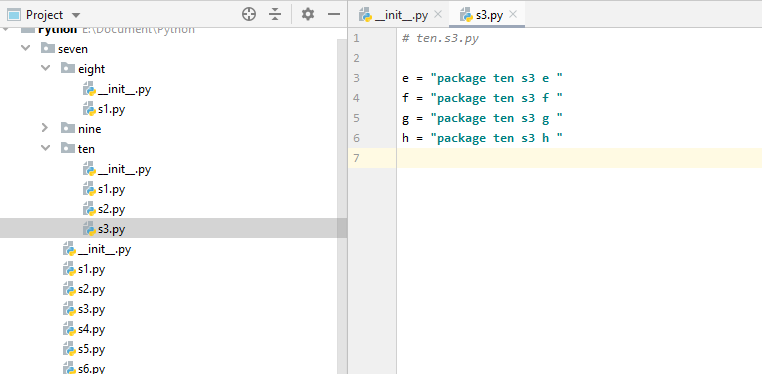
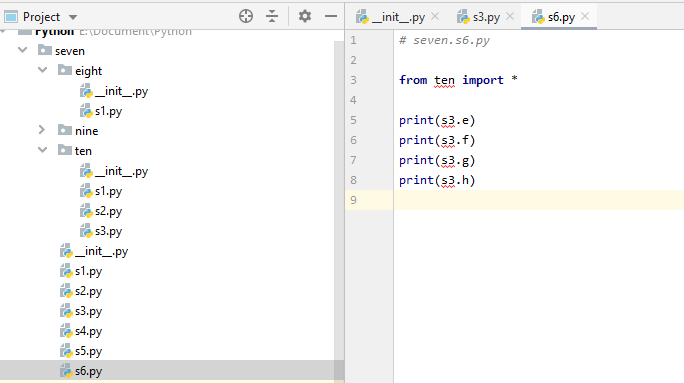
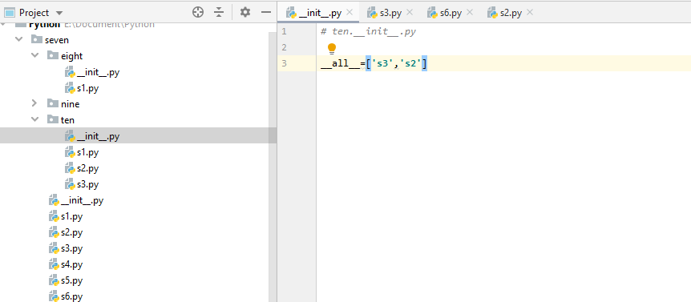
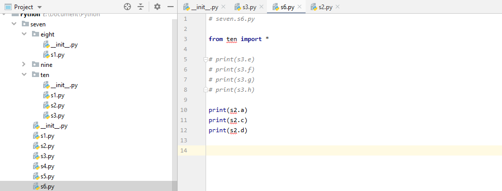

# __init__.py 用法

- 初始化 包 文件，这个包中的模块被引用时，会首先执行此文件中的内容

- ** __all__ = ['module1','module2',...]** 写在 __init__.py 文件开头，可以规定被导入的 模块

> 首先对 ten.__init__.py 进行初始化，规定仅 s3 模块可被导入
> 
> 
> 
> 对 s3 文件进行初始化
> 
> 
> 尝试导入 package ten 中的 s3 模块中的所有变量
> 
> 
> 输出成功
> 
> 
> 
> 尝试导入 package ten 中的 s2 模块中的 变量
> 
> 
> 
> 输出失败
> 
> 
> 
> 修改 ten.__inin__.py 文件， 规定 s2 模块允许被导入
> 
> 
> 
> 尝试导入 package ten 中的 s2 模块中的 变量
> 
> 
> 
> 输出成功
> 
> 

- 引入三个常用的系统内置库(与自己定义的一样)
  
> ** import sys   import datetime   io **
>
> sys.path --- 打此文件的系统路径