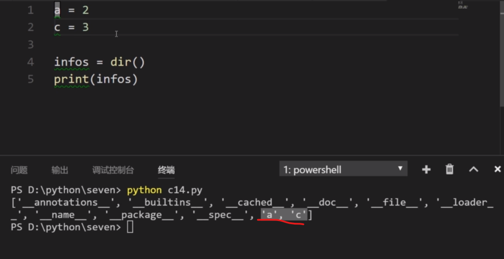
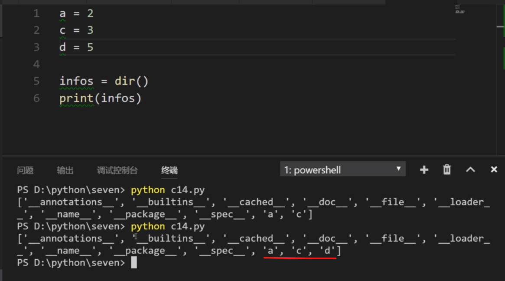
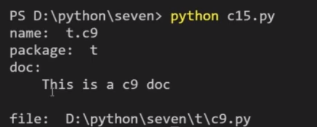
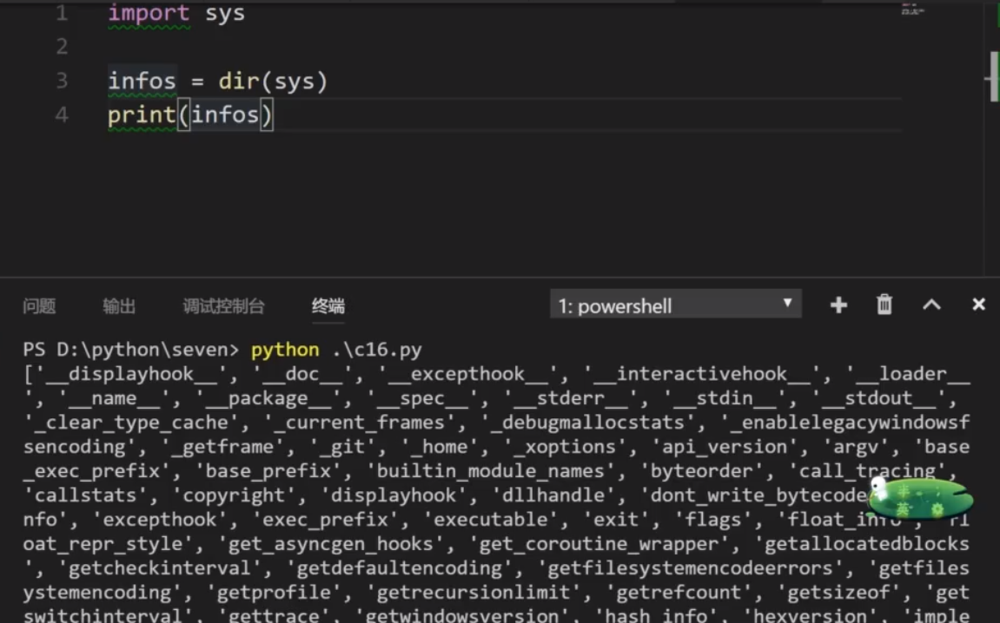
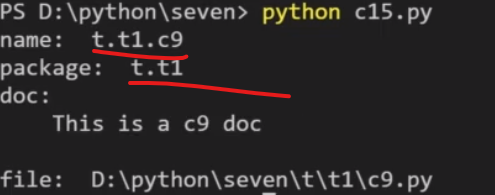

# 模块内置变量

- ** dir() ** --- 返回当前模块中的所有变量

    
    

  

>   **\_\_name\_\_**    --- 文件名
> 
>   **\_\_package\_\_** --- 包名
> 
>   **\_\_file\_\_**    --- 系统路径
> 
>   **\_\_doc\_\_**     --- 模块注释

        # t.c9.py       package t 的 c9模块
        
        '''
            This is a c9 doc
        '''

        print('name:  ' + __name__)
        print('package:  ' + __package__)
        Print('doc:  ' + __doc__)
        print('file:  ' + __file__)

  
- 当 前面有 ** import sys** 时，会打出更多，内置变量

 
 

- 例子

        # t.t1.c9.py    package t 的 sub-package t1 中的 c9模块    
        
        '''
            This is a c9 doc
        '''

        print('name:  ' + __name__)
        print('package:  ' + __package__)
        Print('doc:  ' + __doc__)
        print('file:  ' + __file__)

        #  c15.py       c15 导入模块 c9
        import t.t1.c9

    

  

- ** print('package:  ' + \_\_package\_\_ or '当前不属于任何包')** --- 如果\_\_package\_\_有值，就输出；无值,即为空字符串时，就输出 or 后面的字符串'当前不属于任何包'

- ** print('doc:  ' + \_\_doc\_\_ or '当前模块没有文档注释') ** --- \_\_doc\_\_ 有值就输出；无值，即为空字符串时，输出 or 后字符串

- ** \_\_file\_\_ ** --- 输出的值与所在目录有关