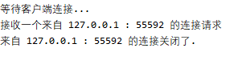

# TCP 编程

日常生活中大多数连接都是可靠的 TCP 连接，创建 TCP 连接时，主动发起连接的称为 客户端，被动响应连接的称为 服务器。

## TCP 客户端编程

举个例子，当我们在浏览器中访问当当网时，计算机就是客户端，浏览器会主动向当当网的服务器发起连接。如果一切顺利，当当网的服务器接受了我们的连接请求，一个TCP连接就建立起来了，后面的通信就是发送网页内容了。

#### 访问当当网的TCP客户端程序

```python
# 获取当当网网页的客户端程序的整个代码

import socket       # 导入 socket 模块
s = socket.socket(socket.AF_INET, socket.SOCK_STREAM)   # 创建一个 socket

s.connect(('www.dangdang.com',80))  # 建立与当当网的连接

s.send(b'GET / HTTP/1.1\r\nHost: www.dangdang.com\r\nConnection: close\r\n\r\n')    # 发送数据请求

# 接收数据
buffer = []
while True:
    d = s.recv(1024)        # 每次最多接收服务器端 1k 字节的数据
    if d:                   # 数据不为空
        buffer.append(d)    # 字节串增加到列表中
    else:                   # 数据为空
        break               # 返回空数据，表示接收完毕，推出循环
data = b''.join(buffer)

s.close()                   # 关闭连接

# 把 HTTP 头 和 网页分开，并将 HTTP 头 打印出来
header, html = data.split(b'\r\n\r\n', 1)	# 以'\r\n\r\n' 分割，且仅仅分割 1 次
print(header.decode('utf-8'))	# decode('utf-8') 以 utf-8 编码将字节串转换成字符串

# 把接收的网页内容写入文件
with open('当当.html', 'wb') as f:
    f.write(html)
```


```python
# output
HTTP/1.1 200 OK
Server: nginx
Date: Wed, 19 Aug 2020 00:24:20 GMT
Content-Type: text/html; charset=GBK
Transfer-Encoding: chunked
Connection: close
```


代码剖析：

1. 创建一个基于 TCP 连接的 socket :

   ```python
   import socket       # 导入 socket 模块
   s = socket.socket(socket.AF_INET, socket.SOCK_STREAM) # 创建一 socket
   ```

   

   创建socket时，AF_INET指定使用IPv4协议，如果要用更先进的IPv6，就指定为AF_INET6。SOCK_STREAM指定使用面向流的TCP，这样，一个socket对象就创建成功了，但是还没有建立连接。

   

2. 建立连接

   ```python
   s.connect(('www.dangdang.com',80))  # 建立与当当网的连接
   ```

   - **<font color="red">注意，参数是一个 tuple, 包含地址 和 端口号.</font>**

   

   客户端要主动发起TCP连接，必须知道服务器的IP地址和端口号。当当网的IP地址可以用域名www.dangdang.com自动转换得到，但是怎么知道当当网服务器的端口号呢？

   

   答案是：作为服务器，提供什么样的服务，端口号就必须固定下来。由于我们想要访问网页，因此当当网提供网页服务的服务器必须把端口号固定在80端口，因为80端口是Web服务的标准端口。其他服务都有对应的标准端口号，例如，SMTP服务是25端口，FTP服务是21端口等。端口号小于1024的是Internet标准服务的端口，端口号大于1024的，可以任意使用。

   

3. 向服务器发送请求

   建立 TCP 连接后，就可就可以向当当网服务器发送请求，要求返回首页的内容：

   ```python
   s.send(b'GET / HTTP/1.1\r\nHost: www.dangdang.com\r\nConnection: close\r\n\r\n')    # 发送数据请求
   ```

   

   TCP连接创建的是双向通道，双方都可以同时给对方发数据。但是谁先发谁后发，如何去协调，要根据具体的协议来决定。

   

   例如，HTTP规定客户端必须先发请求给服务器，服务器收到后才发数据给客户端。

4. 接收数据

   发送的文本格式必须符合HTTP标准，如果格式没问题，接下来就可以接收当当网服务器返回的数据了，代码如下：

   ```python
   # 接收数据
   buffer = []
   while True:
       d = s.recv(1024)        # 每次最多接收服务器端 1k 字节的数据
       if d:                   # 数据不为空
           buffer.append(d)    # 字节串增加到列表中
       else:                   # 数据为空
           break               # 返回空数据，表示接收完毕，推出循环
   data = b''.join(buffer)
   ```

   

   接收数据时，调用recv（max）方法，指定一次最多可以接收的字节数。因此，在一个while循环中反复接收，直到recv()返回空数据，表示接收完毕，退出循环。

   

   data = b''.join（buffer）语句中，b''是一个空字节，join()是连接列表的函数，buffer是一个字节串的列表，使用空字节把buffer这个字节列表连接在一起，成为一个新的字节串。

   

   这个是Python 3新的功能，以前join()函数只能连接字符串，现在可以连接字节串。

   

5. 关闭连接

   当接收完数据后，调用close()方法关闭socket，这样，一次完整的网络通信就结束了。

   ```python
   s.close() # 关闭连接
   ```

6. 把HTTP头和网页分开，将HTTP头打印出来，网页内容保存到文件

   接收到的数据包括HTTP头和网页本身，我们只需把HTTP头和网页分开，将HTTP头打印出来，网页内容保存到文件：

   ```python
   # 把 HTTP 头 和 网页分开，并将 HTTP 头 打印出来
   header, html = data.split(b'\r\n\r\n', 1)	# 以'\r\n\r\n' 分割，且仅仅分割 1 次
   print(header.decode('utf-8'))	# decode('utf-8') 以 utf-8 编码将字节串转换成字符串
   
   # 把接收的网页内容写入文件
   with open('当当.html', 'wb') as f:
       f.write(html)
   ```

   

   现在，只需要在浏览器中打开这个sina.html文件，就可以看到当当网的首页了。

   

   目前一些网站（如新浪网）现已改成使用HTTPS安全传输协议。HTTPS在HTTP的基础上加入了SSL协议，SSL协议依靠证书来验证服务器的身份，并为浏览器和服务器之间的通信加密。读者可以尝试自己编写代码通过HTTPS协议（该协议需要使用SSL模块）访问新浪网首页。

## TCP服务器端编程

与客户端编程相比，服务器端编程要更加复杂一些。服务器端进程首先要绑定一个端口并监听来自其他客户端的连接。如果某个客户端的连接发送过来了，服务器端就与该客户端建立socket连接，然后就可以通过这个socket连接进行通信了。

所以，服务器会打开固定端口（如80）进行监听，每接入一个客户端连接，就创建该socket连接。由于服务器会有大量来自客户端的连接，所以，服务器要能够区分一个socket连接是和哪个客户端绑定的。可通过服务器地址、服务器端口、客户端地址、客户端端口来确定唯一的socket。

但是服务器还需要同时响应多个客户端的请求，因此，每个连接都需要一个新的进程或者新的线程来处理。否则，服务器单次就只能服务一个客户端了。

### 例子

- Target  ：编写一个简单的TCP服务器端程序，可接收客户端的连接请求，并将客户端发过来的字符串加上“Hello”再发回去。

```python
import socket               # 导入 socket 模块
import threading            # 导入 threading 模块
import time                 # 导入 time 模块

def tcplink(sock, addr):
    print("接收一个来自 %s : %s 的连接请求" % addr)
    sock.send(b'Welcom!')   # 发给客户端 Welcom！ 信息
    while True:
        data = sock.recv(1024)  # 接收客户端发来的信息
        time.sleep(1)           # 延时 1 秒
        if not data or data.decode('utf-8') == 'exit':
            # 如果没有数据或收到 'exit' 信息
            break   # 终止循环
        sock.send(('Hello, %s!' % data.decode('utf-8')).encode('utf-8')) # 收到信息后加上 'Hello' 发回

    sock.close()    # 关闭连接
    print("来自 %s : %s 的连接关闭了." % addr)

s = socket.socket(socket.AF_INET, socket.SOCK_STREAM)
s.bind(('127.0.0.1', 8888))    # 监听本机 8888 端口

s.listen(5)                    # 连接的最大数量为 5
print("等待客户端连接...")

while True:
    sock, addr = s.accept()     # 接受一个新连接
    # 创建新线程来处理 TCP 连接
    t = threading.Thread(target = tcplink, args = (sock, addr))
    t.start()
```


- 代码剖析：

1. 在程序中创建一个基于IPv4和TCP的socket

   ```python
   s = socket.socket(socket.AF_INET, socket.SOCK_STREAM)
   ```

   然后，绑定监听的地址和端口。服务器可能有多个网卡，可以绑定到某一个网卡的IP地址上，也可以用0.0.0.0绑定到所有的网络地址，还可以用127.0.0.1绑定到本机地址。

   **127.0.0.1是一个特殊的IP地址，表示本机地址，如果绑定到这个地址，客户端必须同时在本机运行才能连接，也就是说，外部的计算机无法连接进来.**

2. 端口号需要预先指定

   因为我们写的这个服务不是标准服务，所以用8888这个端口号。请注意，小于1024的端口号必须要有管理员权限才能绑定。

   ```python
   s.bind(('127.0.0.1', 8888))    # 监听本机 8888 端口
   ```

3. 监听端口

   调用listen()方法开始监听端口，传入的参数指定等待连接的最大数量为5

   ```python
   s.listen(5)                    # 连接的最大数量为 5
   print("等待客户端连接...")
   ```

4. 等待并返回一个客户端连接

   服务器端程序通过一个无限循环接受来自客户端的连接，accept()会等待并返回一个客户端的连接。

   ```python
   while True:
       sock, addr = s.accept()     # 接受一个新连接
       # 创建新线程来处理 TCP 连接
       t = threading.Thread(target = tcplink, args = (sock, addr))
       t.start()
   ```

   每个连接都必须创建新线程（或进程）来处理，否则，单线程在处理连接的过程中，无法接受其他客户端的连接：

   ```python
   def tcplink(sock, addr):
       print("接收一个来自 %s : %s 的连接请求" % addr)
       sock.send(b'Welcom!')   # 发给客户端 Welcom！ 信息
       while True:
           data = sock.recv(1024)  # 接收客户端发来的信息
           time.sleep(1)           # 延时 1 秒
           if not data or data.decode('utf-8') == 'exit':
               # 如果没有数据或收到 'exit' 信息
               break   # 终止循环
           sock.send(('Hello, %s!' % data.decode('utf-8')).encode('utf-8')) # 收到信息后加上 'Hello' 发回
   
       sock.close()    # 关闭连接
       print("来自 %s : %s 的连接关闭了." % addr)
   ```

   

5.  连接建立后，服务器首先发一条欢迎消息，然后等待客户端数据，并加上'Hello'再发送给客户端。如果客户端发送了exit字符串，就直接关闭连接。

若要测试这个服务器端程序，则还需要编写一个客户端程序

### 编写测试服务器端程序

```python
import socket
s = socket.socket(socket.AF_INET, socket.SOCK_STREAM)
s.connect(('127.0.0.1', 8888))  # 建立连接

# 打印接收到的欢迎信息
print(s.recv(1024).decode('utf-8'))
for data in [b'Michael',b'Tracy',b'Sarah']:
    s.send(data)        # 客户端程序发送人名数据给服务器端
    print(s.recv(1024).decode('utf-8'))

s.send(b'exit')
s.close()
```

需要打开两个命令行窗口，一个运行服务器端程序，另一个运行客户端程序，可以看到运行效果:

- 服务端运行效果



- 客户端运行效果

  

需要注意的是，客户端程序运行完毕就退出了，而服务器端程序会继续运行下去，此时需要按组合键【Ctrl+C】退出程序。

在Python中用TCP进行socket编程十分简单。对于客户端，要主动连接服务器的IP地址和指定端口；对于服务器，要首先监听指定端口，然后，对每一个新的连接，创建一个线程或进程来处理。通常，服务器端程序会持续运行下去。还需注意，同一个端口，被一个socket绑定后，就不能被其他的socket绑定。