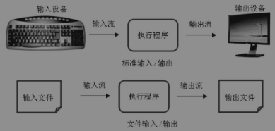

# **<font color="green"> 1. 打开（建立）文件 </font>**

    在Python中访问文件时，必须建立Python Shell与磁盘上文件之间的连接。
    当使用open()函数打开或建立文件时，会建立文件和使用它的程序之间的连接，并返回代表连接的文件对象。
    通过文件对象，就可以在文件所在磁盘和程序之间传递文件内容，执行文件上所有后续操作。
    文件对象有时也称为文件描述符或文件流。

    当建立了Python程序和文件之间的连接后，就创建了“流”数据，如图所示。
    通常程序使用输入流读出数据，使用输出流写入数据，就如同数据流入到程序并从程序中流出。



打开文件后，才能读或写（或读并且写）文件内容。

- **<font color="red"> open()  函数用来打开文.。</font>**
- **<font color="red"> open()函数需要一个字符串路径，表明希望打开文件的位置，返回的是一个文件对象. </font>**

```python
# 语法如下

file_obj = open(file_name[,mode[,buffering]])

# 其中，file_obj是open()函数返回的文件对象，
# 参数 file_name 文件名是必写参数，它既可以是绝对路径，也可以是相对路径。
# 模式（mode）和缓冲（buffering）可选。
```

- **<font color="red"> model 是指明文件类型和操作的字符串.</font>**

open 函数中 mode 参数常用值

|值|描述|       
|--|---|
| 'r' | 读模式(默认模式），如果文件不存在，则发生异常|
| 'w' | 写模式，如果文件不存在，则先创建文件再打开；如果文件，存在，则先清空文件内容再打开|
| 'a' | 追加模式，如果文件不存在，则先创建文件再打开路过文件，存在，打开文件后将新内容追加至原内容之后|
| 'b' | 二进制模式，可添加到其他模式中使用|
| '+' | 读/写模式，可添加到其他模式中使用|


- **<font color="red"> buffering 参数 控制缓冲。</font>**

|值|描述|       
|--|---|
|0 or False| 输入/输出(I/O)是无缓冲的，所有读写操作直接针对硬盘，只有使用 flush 或 close 时，才会将数据写入硬盘.|
|1 or True| I/O 有缓冲，此时 Python 使用内存代替硬盘，使程序运行速度加快.|
|大于 1| I/O 有缓冲，且 数字表示缓冲区的大小，以字节为单位；负数表示使用默认缓冲区大小.|


### **<font color="green"> Open（）函数的使用方法 </font>**

- 先用记事本创建一个文本文件，将其命名为Hello.txt，输入以下内容保存在同一文件夹中：

``` Hello.txt
Hello World!!!

Good Good Study

Day Day Up
```
  
```python
hello_file_path = ".\Hello.txt"

helloFile= open(hello_file_path)

print(helloFile)

# Output
# <_io.TextIOWrapper name='.\\Hello.txt' mode='r' encoding='cp936'>
```

- 条命令将以读取文本文件的方式打开放在D盘的Python文件夹下的hello文件。“读模式”是Python打开文件的默认模式。当文件以读模式打开时，只能从文件中读取数据而不能向文件写入或修改数据。

- 当调用open()函数时，程序将返回一个文件对象，在本例中文件对象保存在helloFile变量中。

- 在打印文件对象时我们可以看到文件名、读/写模式和编码格式。cp936就是指Windows系统里第936号编码格式，即GB2312的编码。接下来，就可以调用helloFile文件对象的方法读取文件中的数据。