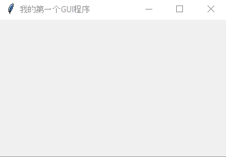

# 创建 Windows 窗口

```python
# 使用 Tkinter 创建一个 Windows 窗口的 GUI 程序示例
import tkinter                          # 导入 Tkinter 模块
win = tkinter.Tk()                      # 创建 Windows 窗口对象
win.title('我的第一个 GUI 程序')         # 设置窗口标题
win.mainloop()                          # 进入消息循环，也就是显示窗口
```



```python
# geometry() 方法设置窗口的大小
窗口对象.geometry(size)

# size 指定窗口大小
宽度 x 高度 (注：x 是小写 x, 不是乘号)

# 例如 ： 显示一个 Windows 窗口，初始大小为 800 x 600
from tkinter import *
win = Tk()
win.geomery("800x600")
win.mainloop()
```

```python
# 使用 minsize() 方法设置窗口的最小尺寸
# 使用 maxsize() 方法设置窗口的最大尺寸

窗口对象.minsize(最小宽度，最小高度)
窗口对象.maxsize(最大宽度，最大高度)

# 例如：
from tkinter import *
win = Tk()
win.geometry("800x600")
win.minsize(400, 600)
win.maxsize(1440, 800)
win.mainloop()
```

