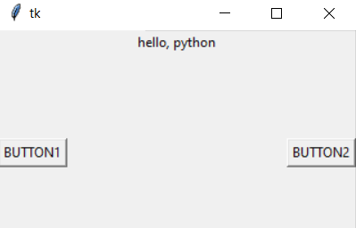
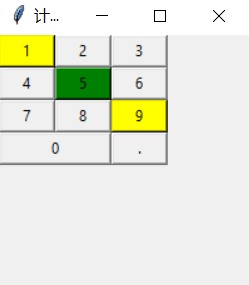

# 几何布局管理器

Tkinter 几何布局管理器（Geometry Manager) 用于组织和管理父组件(往往是窗口)中子组件的布局方式。

Tkinter 提供了三种风格的几何布局管理类 : pack、grid 和 place.

## 1. pack 几何布局管理器

pack 几何布局管理器采用块的方式组织组件。

- pack 布局可根据 **<font color="blue">子组件创建生成的顺序，将其放在快速生成界面的设计中。</font>**

```python
# 调用子组件的方法 pack（），则该子组件在其父组件中采用 pack 布局：
pack(option = value, ...)
```

pack 方法提供如表所示的若干参数选项。

|选项|描述|取值范围|
|----|---|--------|
| side | 停靠在父组件的哪一边上 | 'top'（默认值), 'bottom', 'left', 'right'|
| anchor | 停靠位置，对应于东南西北中以及四个角 | 'n', 's', 'e', 'w', 'nw', 'sw', 'se', 'ne', 'center'(默认值)|
| fill | 填充空间 | 'x', 'y', 'both', 'none'|
| expand | 扩展空间 | 0 或 1 |
| ipadx, ipady | 组件内部在 x/y 方向上填充的空间大小| 单位为 c (厘米)、m（毫米）、i(英寸)、p（打印机的点）|
| padx, pady | 组件外部在 x/y 方向上填充的空间大小 | 单位为 c (厘米)、m(毫米)、 i(英寸)、p(打印机的点) |

```python
# pack 几何布局管理器的 GUI 程序示例
import tkinter
root = tkinter.Tk()
label = tkinter.Label(root, text = 'hello, python')
label.pack()            # 将 Label 组件添加到窗口中显示

button1 = tkinter.Button(root, text = "BUTTON1")    # 创建文字是 "BUTTON1" 的 Button 组件
button1.pack(side = tkinter.LEFT)   # 将 BUTTON1 组件添加到窗口中显示，左停靠

button2 = tkinter.Button(root, text = "BUTTON2")    # 创建文字 是 "BUTTON2" 的 Button 组件
button2.pack(side = tkinter.RIGHT) # 将 BUTTON2 组件添加到窗口中显示，右停靠

root.mainloop()
```



## 2. grid 几何布局管理器

grid 几何布局管理器采用表格结构组件。

子组件的位置由 行/列 确定的单元格决定，子组件可以跨越多行/列。

在每一列中，列宽由这一列中最宽的单元格确定。

采用 grid 布局，适合于 **<font color="blue"> 表格的形式的布局 </font>**，可以实现复杂的界面。

```python
# 调用子组件的 grid() 方法，则该子组件在其父组件中采用 grid 布局 ：
grid(option = value, ...)
```

grid() 方法提供如表所示的若干参数选项:

| 选项 | 描述 | 取值范围 |
|------|------|---------|
| sticky | 组件紧贴所在单元格的某一边角，对应于东南西北中以及四个角 | 'n', 's', 'e', 'w', 'nw', 'sw', 'se', 'ne', 'center'(默认值) |
| row | 单元格行号 | 整数 |
| column | 单元格列号 | 整数 |
| rowspan | 行跨度 | 整数 |
| columnspan | 列跨度 | 整数 |
| ipadx, ipady | 组件内部在 x/y 方向上填充的空间大小 | 单位为 c (厘米)、 m (毫米)、 i (英寸)、p（打印机的点）|
| padx, pady | 组件外部在 x/y 方向上填充的空间大小 | 单位为 c (厘米)、 m（毫米）、i(英寸)、p(打印机的点) |

- grid() 方法中两个最为重要的参数， **<font color="red"> row </font>** 和 **<font color="red"> column </font>.**

- 它们可以用来指定将子组件放置到什么位置，如果不指定 row, 则会将子组件放置到第一个可用的行上；如果不指定 column，则使用第0列（首列）。

```python
# grid 几何布局管理器的 GUI 程序示例
from tkinter import *
root = Tk()

# 200x200 代表了初始化时主窗口的大小，280、280 代表了初始化时窗口所在的位置
root.geometry('200x200+280+280')
root.title('计算器示例')

# Grid 网格布局
L1 = Button(root, text = '1', width = 5, bg = 'yellow')
L2 = Button(root, text = '2', width = 5)
L3 = Button(root, text = '3', width = 5)
L4 = Button(root, text = '4', width = 5)
L5 = Button(root, text = '5', width = 5, bg = 'green')
L6 = Button(root, text = '6', width = 5)
L7 = Button(root, text = '7', width = 5)
L8 = Button(root, text = '8', width = 5)
L9 = Button(root, text = '9', width = 5, bg = 'yellow')
L0 = Button(root, text = '0')
Lp = Button(root, text = '.')
L1.grid(row = 0, column = 0)    # 按钮放置在 0行 0列
L2.grid(row = 0, column = 1)    # 按钮放置在 0行 1列
L3.grid(row = 0, column = 2)    # 按钮放置在 0行 2列
L4.grid(row = 1, column = 0)    # 按钮放置在 1行 0列
L5.grid(row = 1, column = 1)    # 按钮放置在 1行 1列
L6.grid(row = 1, column = 2)    # 按钮放置在 1行 2列
L7.grid(row = 2, column = 0)    # 按钮放置在 2行 0列
L8.grid(row = 2, column = 1)    # 按钮放置在 2行 1列
L9.grid(row = 2, column = 2)    # 按钮放置在 3行 2列
L0.grid(row = 3, column = 0, columnspan = 2, sticky = E + W)    # 跨 2 列， 左右贴紧
Lp.grid(row = 3, column = 2, sticky = E + W)    # 左右贴紧
root.mainloop()
```



## 3.place 集合窗口布局管理器

place 集合布局管理器允许开发者指定组件的大小与位置。

place 的优点是可以精确控制组件的位置；缺点是改变窗口大小时，子组件 不能随之灵活改变大小。

```python
place (option = value, ...)
```

place() 方法 提供如表所示的若干参数选项，可以直接对参数选项赋值进行修改。

| 选项 | 描述 | 取值范围 |
|------|------|---------|
| x,y | 将组件放到指定位置的绝对坐标 | 从 0 开始的整数 |
| relx, rely | 将组件放到指定位置的绝对坐标 | 0 ~ 1.0 |
| height, width | 高度和宽度，单位为像素 | 从 0 开始的整数 |
| anchor | 对齐方式，对应于东南西北中以及四个角 | 'n', 's', 'e', 'w', 'nw', 'sw', 'se', 'ne', 'center'('center' 为默认值)|

**注： Python 的坐标系是左上角为原点 （0,0）位置，向右是 x 坐标正方向，向下是 y 坐标正方向，与数学的几何坐标系不同。**

```python
# place 几何布局管理器的 GUI 示例程序
from tkinter import *
root = Tk()
root.title("登陆")
root['width'] = 200
root['height'] = 80
Label(root, text = '用户名', width = 6).place(x = 1, y = 1)      # 绝对坐标 （1, 1）
Entry(root, width = 20).place(x = 45, y = 1)                    # 绝对坐标 （45, 20）
Label(root, text = '密码', width = 6).place(x = 1, y =20)       # 绝对坐标  （1，20）
Entry(root, width = 20, show = '*').place(x = 45, y = 20)      # 绝对坐标   (45, 20)
Button(root, text = '登陆', width = 8).place(x = 40, y = 40)   # 绝对坐标   （40, 40)
Button(root, text = '取消', width = 8).place(x = 110, y = 40)  # 绝对坐标 （110, 40)
root.mainloop()
```
![place 几何布局管理器的 GUI 示例程序]


