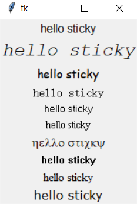

# Tkinter 字体

通过组件的 **font 属性**， 可以设置其显示文本的字体.

设置组件字体前首先要能表示一个字体.

### 1. 通过元组表示字体

通过三个元素的元组,可以表示字体：

```python
(font family, size, modifiers)
```
- **font family** ：字体名
  
- **size** : 字体大小, 单位为 **point**

- **modifiers** : 样式修饰符
  
  - **粗体**
  
  - **斜体**
  
  - **下划线** 

```python
from tkinter import *
root = Tk()

# 创建 Label

for ft in ("Arial", ("Courier New", 19, "italic"), ("Comic Sans MS",),
           "Fixdsys",("MS Sans Serif",), ("MS Serif",), "Symbol", "System",
            ("Times New Roman",), "Verdana"):
    Label(root, text = "hello sticky", font = ft).grid()

root.mainloop()
```



- 这个程序在 Windows 上测试字体显示，注意包含空格的字体名称必须指定为 **tuple** 元组类型.

### 2.通过 Font 对象表示字体

可以使用 **tkFont.Font** 来创建字体

```python
# 格式如下：
ft = tkFont.Font(family = '字体名', size, weight, slant, underline, overstrike)
```

其中:
- **size** : **字体大小**
- **weight="bold" or "normal"** ：**bold** **粗体**
- **slant="italic" or "normal"** : **italic** **斜体**
- **underline=1或0** ： **1** **下划线**
- **overstrike=1或0** : **1** **删除线**

```python
ft = Font(family="Helvetica", size = 36, weight = "bold")
```

```python
# 通过 Font 对象设置标签 label 的字体示例

from tkinter import *
import tkinter.font         # 导入字体模块
root = Tk()

# 指定字体名称、大小、样式
ft = tkinter.font.Font(family = 'Fixdsys', size = 20, weight = 'bold')
Label(root, text = "hello sticky", font = ft).grid()    # 创建一个 Label
root.mainloop()
```


```python
# 通过 tkFont.families() 函数可以返回所有可用的字体
from tkinter import *
import tkinter.font     # 导入字体模块
root = Tk()
print(tkinter.font.families())
```