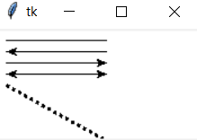

# 绘制线条

使用 **<font color="blue"> create_line() </font>** 方法可以创建一个线条对象，具体语法如下：

> **<font color="orange"> line = canvas.create_line(x0, y0, x1, y1, ... , xn, yn, 选项） </font>**
> 
> 参数 x0, y0, x1, y1, ......, xn, yn 是线段的端点.

- 创建线段对象时常用选项 ：
    - **<font color="blue"> width - 指定线段宽度 </font>**
    - **<font color="blue"> arrow - 指定是否用箭头  </font>**
      - **<font color="blue"> none - 没有箭头 </font>**
      - **<font color="blue"> first - 起点有箭头 </font>**
      - **<font color="blue"> last - 终点有箭头 </font>**
      - **<font color="blue"> both - 两端有箭头 </font>**
    - **<font color="blue">  fill - 指定线段颜色 </font>**
    - **<font color="blue">  dash - 指定线段为虚线（其数值决定虚线的样式） </font>**

```python
# 使用 create_line() 方法创建线条对象的示例，运行效果如图所示
from tkinter import *
root = Tk()

cv = Canvas(root, bg = 'white', width = 200, height = 100)

cv.create_line(10, 10, 100, 10, arrow = 'none')     # line without arrow
cv.create_line(10, 20, 100, 20, arrow = 'first')    # line with head arrow
cv.create_line(10, 30, 100, 30, arrow = 'last')     # line with tail arrow
cv.create_line(10, 40, 100, 40, arrow = 'both')     # line with head and tail arrow
cv.create_line(10, 50, 100, 100, width = 3, dash = 7) # dash line

cv.pack()

root.mainloop()
```

