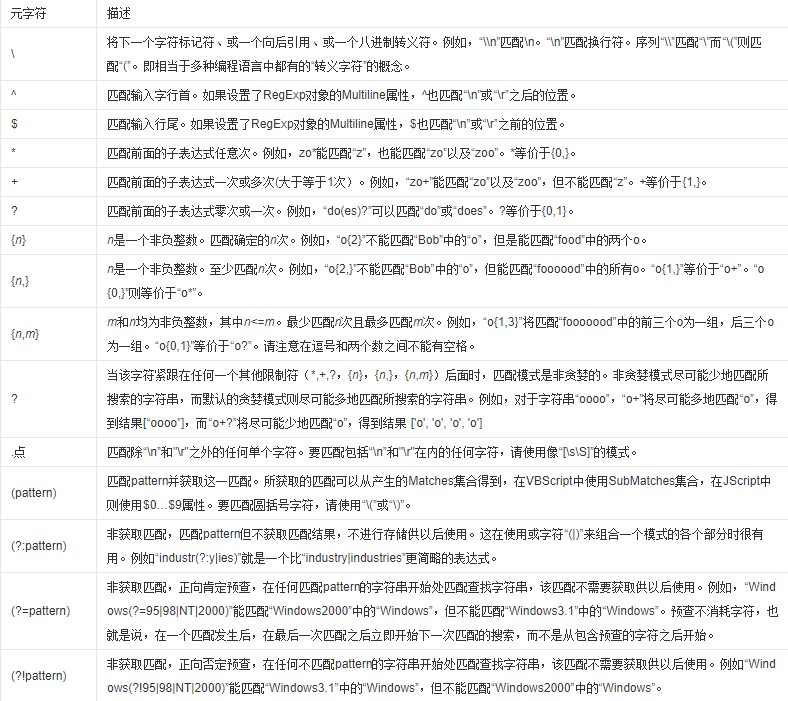
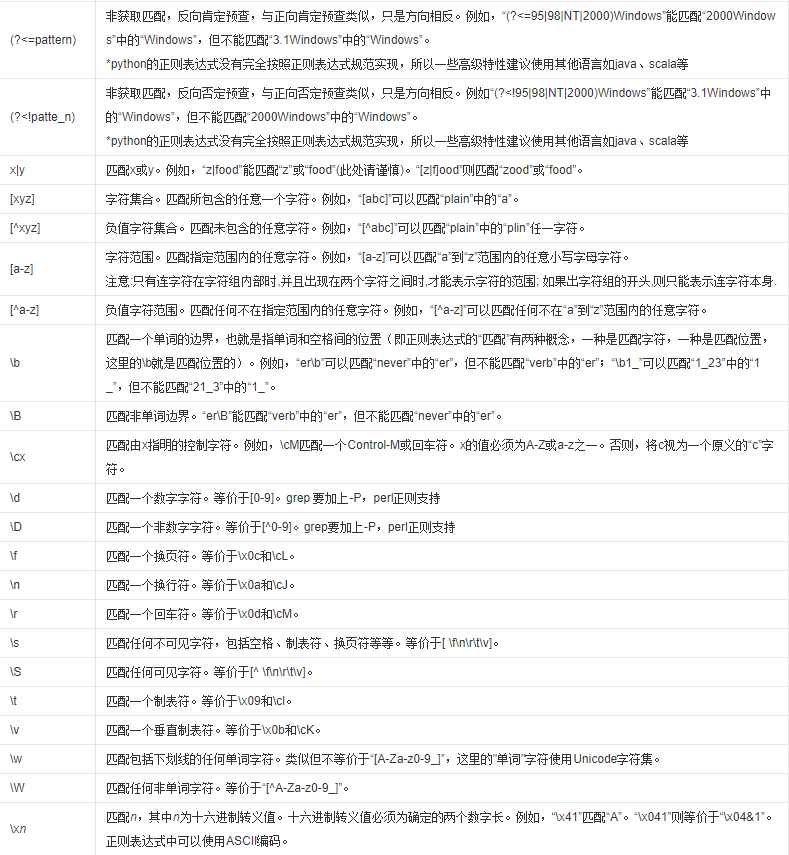
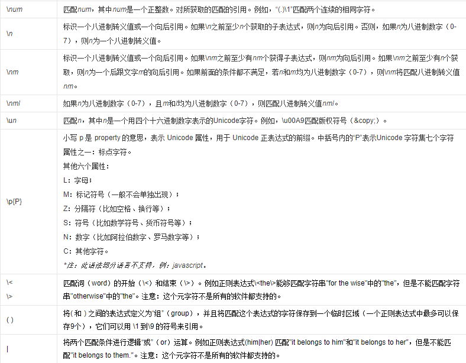

# 初识正则表达式

- 正则表达式是一个特殊的字符序列,来判断一个字符串是否与我们所设定的这样字符序列相匹配

## 作用
- 用来快速检测文本、实现一些替换文本的操作

- 例如：
  1. 检查一串数字是否是电话号码
  2. 检测一个字符串是否符合 email
  3. 把一个文本里指定的单词替换为另一个单词
   

## 语法

```python
import re
re.findall(pattern, string,flags=0)
```


## 普通字符与元字符

- 正则表达式，通常情况下是 普通字符 + 元字符 一起使用

### 普通字符
- 由用户定义的字符

```python
a = 'python'
```

### 元字符
- 由系统提供的代表一类字符的特殊字符





### 建议：
1. 可以使用别人已经写好的正则表达式（站在提高工作效率）
2. 分卸别人写好的正则表达式（学习角度）
3. 有意识地多去使用