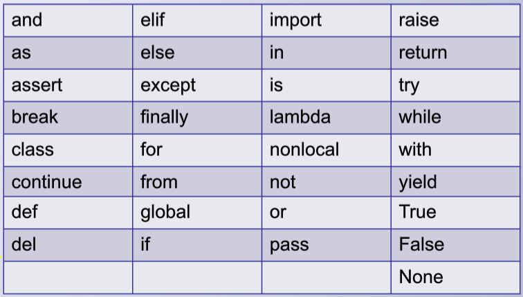

# 变量

### **<font color="blue"> 变量的定义 </font>**
- 定义：存储计算结果或表示值抽象的存储单元。即，变量是用来存储和标识具体数据值的，数据的调用和操作是通过变量的名称。

- 用很简单简洁的英文单词来表示一个变量，增强代码可读性
  
  - 命名方式： **<font color="green"> variable_name = variable_value </font>**
  
- " = " 为赋值符号，而非数学中的等号，数学中的等号为 "=="，来判断两数是否相等
  
   
### **<font color="blue"> 变量的命名规则 </font>**

1. 变量名只允许包含`字母（区分大小写 ： a～z, A～Z）`、`数字`和`下画线`。变量名可以以字母或下画线开头，但第`一个字符不能是数字`。

   ```python
   username  # OK
   userName2 # OK
   2userName # Error
   ```

   

2. 变量名`不允许包含空格`，但`可使用下画线来分隔其中的单词`。

   ```python
   user_name # OK
   user name # Error
   ```

   

3. 在Python程序中对`大小写是敏感`的.

   ```python
   username 和 userName 是不同的变量名
   ```

   

4. 变量命名应既简短又具有描述性.

   ```python
   name 比 n 好
   user_name 比 u_n 好
   ```

   

5. 慎用小写字母l和大写字母O，因为它们可能被人错看成数字1和0。另外，字母p的大小写也应慎用，不易区分。

   

6. 不要使用Python程序已经保留用于特殊用途的 Python关键字(保留字）和函数名作为变量名:



- **<font color="red"> type 、 print</font> 虽然能作为变量名使用，但是系统常用保留字不推荐使用,容易引起后续代码的错误**
```python
a = 2

2a = 2    # error

_2 = 2

and = 2 # error

if = 2 # error

import = 2 # error
```


```python
type = 3

print(type)

3

type = 1

type(type)

# Type error 
```

```python
print = 3

print(print) # Type error
```

> 注意：
>
> 编写Python程序过程中，建议使用`小写`的Python变量名。在变量名中使用大写字母虽然不会导致错误，但避免使用大写字母，这样可以更利于程序代码的阅读。

### **<font color="blue"> Python 命名为 <font color="red"> 隐式 </font> 命名</font>**
- 隐式命名： 不用声明变量类型，python 编译器会自动识别 变量类型，也即为 **<font color="red"> 动态语言 </font>**
- 显式命名： 需要声明变量类型，如C/C++、Java、C#等语言
- 在显式命名中，已经声明类型变量，不能赋予其他类型的数值