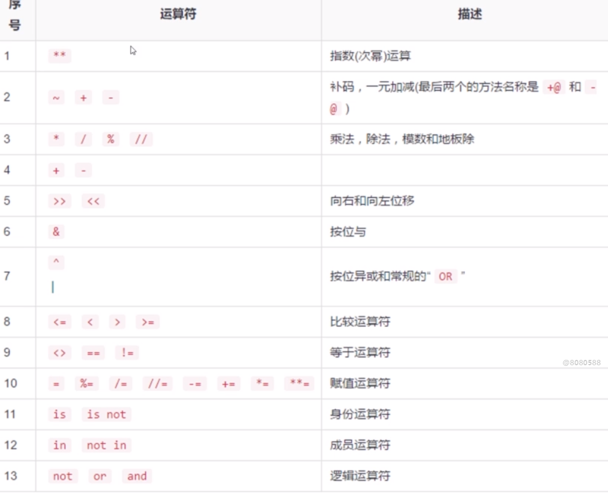

# 表达式

 **<font color="red">表达式（Expression） 是 运算符（operator） 和 操作数（operand) 所构成的序列</font>**


## **<font color="blue"> 运算符优先级 </font>**
1. 运算不止仅有数字运算符有优先级，其他的也一样
2. 括号的优先级要高于其他
3. 优先级的计算一般是从左到右（赋值运算符除外）
4. 赋值运算的优先级，右边计算完成后再给左边参数
5. not > and > or
6. 括号（）的优先级最高



- `左结合、右结合`

```python
a or b and c    # 从左向右，左结合
c =  a + b      # 右结合，先计算 a + b 再把值赋给 c
```

```python
a = 1
b = 2
c = 3
(a or b) and c  #  (0001 or 0010) and 0011 = 0011 and 0011 = 0011 = 3
```

- `用括号()标注顺序`:

```python
# 无括号情况
a = 1
b = 2
c = 2
not a or b + 2 == c     //  False

# 有括号情况
（（not a） or （(b + 2) == c））
```

