# **导入模块**

## 方式一 ** import **

- ** import module ** 只导入模块名，使用变量时需要 在模块名后加 . 和 变量名，即 ** module.variable **
- 先定义后使用
- ** import module as another_name ** 可以另起模块名字，代替原名字使用

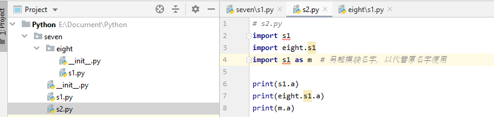
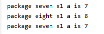
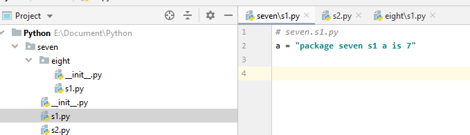
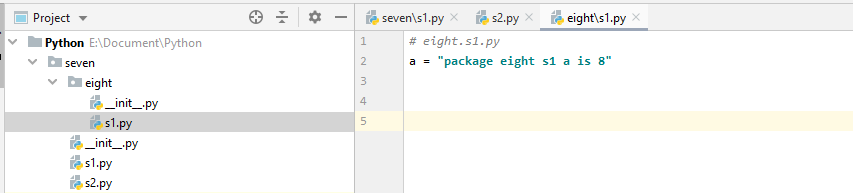

## 方式二 ** from import **

- ** from module import variable ** 直接导入变量 variabl
- ** from module import (variable1,variabl2,variabl3,....) ** 直接导入多个变量 variabl1, variabl2, variabl3, .....
- ** from package import module **  导入模块
- ** from module import * **   \*  为通配符，导入模块中的所有变量

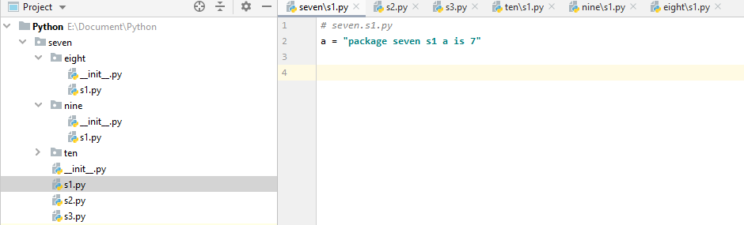
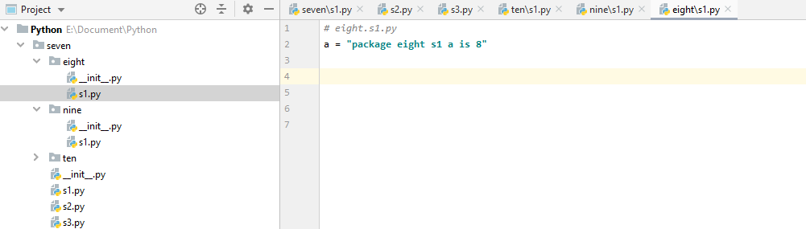
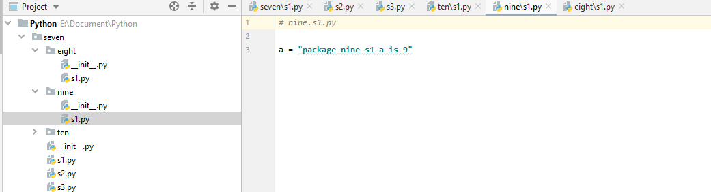
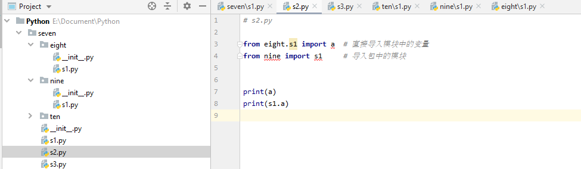
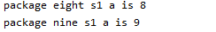
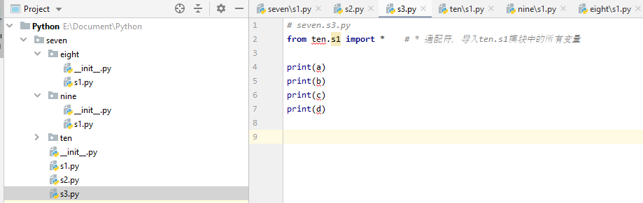
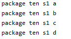

- ** \_\_all\_\_ = ['variable1', 'variable2',...] **

    -   导入选定导入的变量 variable1, varaible2, ...

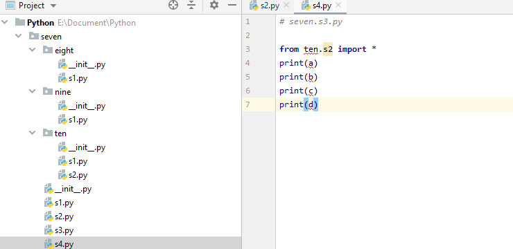
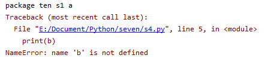
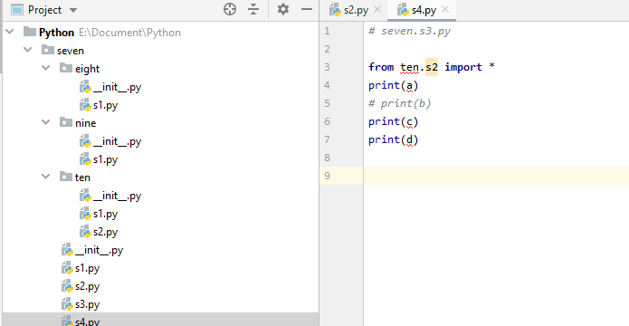
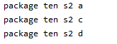

