# 绝对导入 和 相对导入

## ** 绝对导入 **

- 绝对路径，从顶级包开始
- 可执行文件位置，决定顶级包
- 与可执行文件同级的包，为顶级包

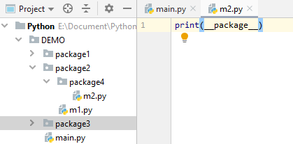
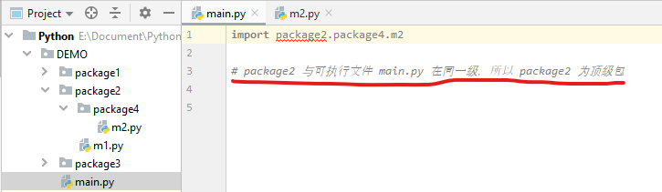
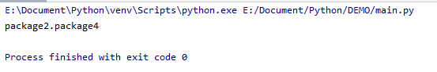

 ## ** 相对导入 **

- 相对路径：

> . 当前目录
> 
> .. 上层目录
> 
> ... 上上层目录
> 
> .... 上上上层目录
> 
> ...... 依次类推

 
 
 

## ** 不能使用相对路径导入模块：**
  - ** 可执行文件，即入口文件 **，不能使用相对路径来导入,因为没有包来作为普通模块

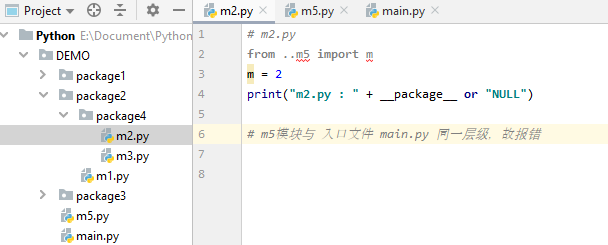
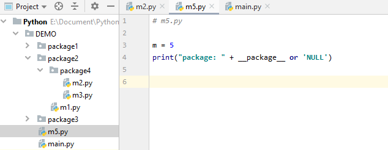
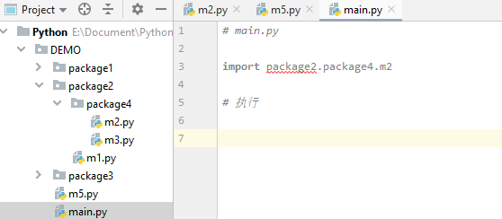
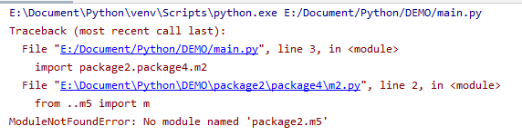

- ** 能使用相对路径导入模块：**
  
  - ** 同级模块 ** 导入：
  
    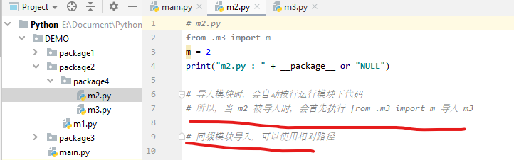
    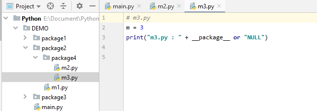
    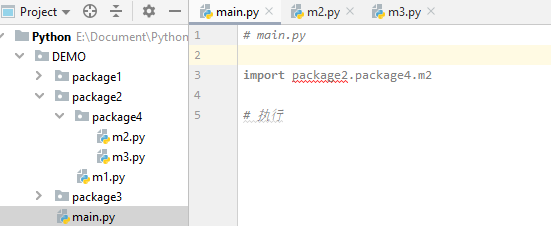

  - ** 向上层级，但不能跟入口文件同一层级的模块 ** 导入：
  
    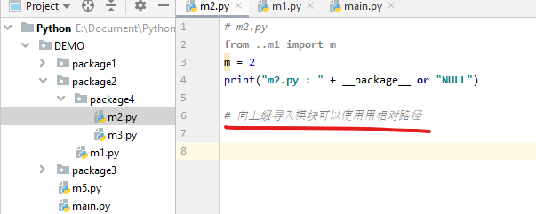
    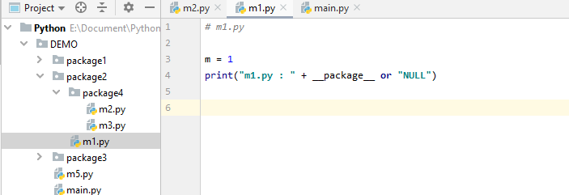
    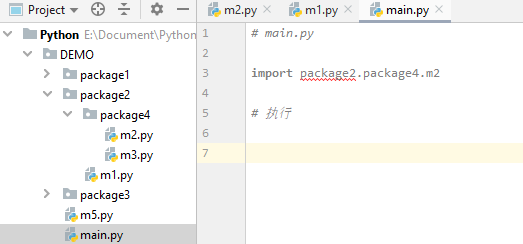
    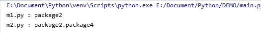

> _** 相对路径之所以能够找到模块，是因为根据 当前内置模块变量 \_\_name \_\_ 来定位，但是由于 main.py 是一个入口文件，入口文件被执行后， \_\_name\_\_ 变量就不再是入入口文件本身的模块名，它的\_\_name\_\_将被 python 强行改成\_\_main\_\_，但是模块\_\_main\_\_是不存在的,所有入口文件不可以使用相对路径来导入模块**_

## **入口文件使用 相对路径导入模块**

- 将入口文件当作一个模块来运行，就可以在入口文件中用相对路径导入模块
- 即，去到入口文件上一层级来执行

    
    
    
