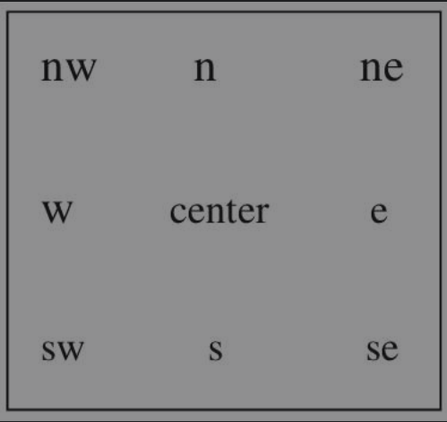
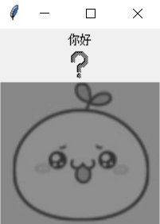
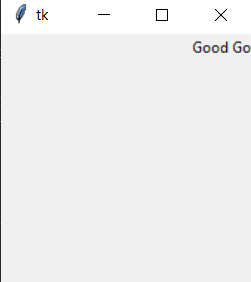

# Tkinter 组件

Tkinter 提供各种组件（控件），如按钮、标签、文本框，可以在一个GUI应用程序中使用。

这些组件通常被称为控件或者部件。

目前常用的 Tkinter 组件如表。

| 组件 | 描述 |
|------|-----|
| Button | 按钮组件，用于显示按钮 |
| Canvas | 画布组件，用于显示图形元素，如线条或文本 |
| Checkbutton | 多选框组件，用于在程序中提供多项选择框 |
| Entry | 输入组件，用于显示简单的文本内容 |
| Frame | 框架组件，用于显示一个矩形区域，多用来作为容器 |
| Label | 标签组件，用于显示文本和位图 |
| Listbox | 列表框组件，用于显示一个字符串列表 |
| Meanbutton | 菜单按钮组件，用于显示菜单项 |
| Menu | 菜单组件，用于显示菜单栏、下拉菜单 和 弹出菜单 |
| Message | 消息组件，用于显示多行文本，与 Label 类似 |
| Radiobutton | 单选按钮组件，用于显示一个单选的按钮状态 |
| Scale | 范围组件，用于显示一个数值刻度，为输出限定范围的数字区间 |
| Scrollbar | 滚动条组件，当内容超过可视化区域时使用，如列表框 |
| Text | 文本组件，用于显示多行文本 |
| Toplevel | 容器组件，用来提供一个单独的对话框，与 Frame 类似 |
| Spinbox | 输入组件，与 Entry 类似，但可以指定输入范围 |
| PanedWindow | 窗口布局管理插件，可以包含一个或者多个子组件 |
| LabelFrame | 简单的容器组件，常用于复杂的窗口布局 |
| tkMessageBox | 用于显示应用程序的消息框 |

通过组件类的构造函数可以创建对象示例。

```python
from tkinter import *
root = Tk()
button1 = Button(root, text = "确定") # 按钮组件的构造函数
```
组件标准属性也就是所有组件（控件）的共同属性，如大小、字体、颜色等。

常用的标准属性如表：

- Tkinter 组件标准属性

| 属性 | 描述 |
|-----|------|
| dimension | 组件大小 |
| color | 组件颜色 |
| font | 组件字体 |
| anchor | 锚点（内容停靠位置），对应于东南西北中以及四个角 |
| relief | 组件样式 |
| bitmap | 位图，内置位图包括 ： "error"、"gray75"、"gray50"、"gray25"、"gray12"、"info"、"questhead"、"hourglass"、"questtion" 和 "warning"，自定义位图为 .xbm 格式文件 |
| cursor | 光标 |
| text | 显示文本内容 |
| state | 设置组件状态，包括正常（normal)、激活（active）、禁用（disabled) |

可以通过下列几种方式设置组件属性。

```python
button1 = Button(root, text = "确定") # 按钮组件的构造函数
button1.config(text = "确定")     # 组件对象的 config() 方法的命名参数
button1 ["text"] = "确定"         # 组件对象的属性赋值
```

### 1. 标签（Label) 组件

Label 组件用于在窗口中显示文本或位图。

Anchor 属性指定文本 （text) 或图像 (bitmap/image) 在 Label 中的显示位置（如图所示，其他组件同此）。

对应于东南西北中，以及四个角，可用如下值：



```
e  : 垂直居中，水平居右
w  ：垂直居中，水平居左
n  : 垂直居上，水平居中
s  : 垂直居下，水平居中
ne : 垂直居上，水平居右
se : 垂直居下，水平居右
sw : 垂直居下，水平居左
nw : 垂直居上，水平居左
center(默认值) ： 垂直居中，水平居中
```

```python
# Label 组件示例
from tkinter import *
win = Tk()                                          # 创建窗口对象
win.title("我的窗口")                               # 设置窗口标题
lab1 = Label(win, text = "你好", anchor = "nw")     # 创建文字是你好的 Label 组件
lab1.pack()                                         # 显示 Label 组件

# 显示内置的位图
lab2 = Label(win, bitmap = 'question')              # 创建显示疑问图标 Label 组件
lab2.pack()                                         # 显示 Label 组件

# 显示自选的图片
bm = PhotoImage(file = "00.Resource\05.png")
lab3 = Label(win, image = bm)
lab3.bm = bm
lab3.pack()                                         # 显示 Label 组件
win.mainloop()
```



### 2. 按钮 （Button） 组件

Button 组件（控件）是一个标准的 Tkinter 部件，用于实现各种按钮功能。

按钮可以包含文本或图像，可以通过 **<font color="blue"> command </font>** 属性将调用 Python 函数或方法关联到按钮上。

当这些按钮被按下时，就会自动调用该函数或方法。

### 3. 单行文本框 （Entry) 组件和多行文本框 （Text） 组件

单行文本框组件主要用于输入单行内容和显示文本，可以方便地向程序传递用户参数。

##### （1）创建和显示 Entry 对象：

- 创建 Entry 对象的基本方法：

```python
Entry 对象 = Entry（Windows窗口对象）
```

- 显示 Entry 对象的方法：

```python
Entry 对象.pack()
```

##### (2) 获取 Entry 组件的内容：

- **<font color="blue"> get() </font>** 方法用于获取单行文本框内输入的内容。

设置或者获取单行文本框组件的内容也可以使用 **<font color="blue"> StringVar()</font>** 来完成，把单行文本框组件的 **<font color="blue"> textvariable </font>** 属性设置为 StringVar() 变量，再通过 StringVar() 变量的 **<font color="blue"> get() </font>** 和 **<font color="blue"> set() </font>** 函数可以读取 和 输出相应文本内容。

```python
s = StringVar()                                 # 一个 StringVar() 对象
s.set("大家好，这是测试")                        # 设置文本内容
entryCd = Entry(root, textvariable = s)         # Entry 组件显示 "大家好，这时测试"
print(s.get())
```
##### (3) 单行文本框组件的常用属性

- **show** : 如果设置为字符 *, 则输入文本内显示为 *, 用于密码输入.
  
- **insertbackground** : 插入光标的颜色，默认为黑色 'black'.

- **selecbackground** 和 **selectforeground** : 选中文本的背景色与前景色.

- **width** : 组件的宽度 （所占字符个数）.

- **fg** : 字体前景颜色.

- **bg** : 背景颜色.

- **state** : 设置组件状态，默认为 **normal**，可设置为 ：**disabled** **禁用组件**， **readly** **只读**.

同样地，Python 提供输入多行文本框组件，用于输入多行内容和显示文本.

使用方法类似于单行文本框组件，具体方法请读者参考 Tkinter 手册.

### 4. 列表框（Listbox) 组件

列表框（Listbox) 组件可用于显示多个项目，并且允许用户选择一个或多个项目.

##### （1） 创建和显示 Listbox 对象

创建 Listbox 对象的基本方法：

```python
Listbox对象 = Listbox(Tkinter Windowss窗口对象)
```

显示 Listbox 对象的方法如下：

```python
Listbox对象.pack()
```

##### (2) 插入文本项

可以使用 insert() 方法向列表框组件中插入本项，方法如下：

```python
Listbox对象.insert(index, item)
```

其中：

  - **index** 是插入文本项的位置，如果在 **尾部** 插入文本项，则可以使用 **END**；如果在 **当前选项处** 插入文本项，则可以使用 **ACTIVE**.
  
  - **Item** 是要插入的文本项.

##### (3) 返回选中项索引

```python
Listbox对象.curselection()
```

返回当前选中项目的索引，结果为元组.

**注意：索引从 0 开始， 0 表示第一项。**

##### （4） 删除文本项

```python
Listbox对象.delete(first, last)
```

删除指定范围 （first, last) 的项目，不指定 last 时，删除一个项目.

##### （5） 获取项目内容

```python
Listbox.对象.get(first, last)
```

返回指定范围 (first, last) 的项目，不指定 last 时，仅返回一个项目.

##### (6) 获取项目个数

```python
Listbox.对象.size()
```

##### (7) 获取 Listbox 内容

需要使用 listvariable 属性为 Listbox 对象指定一个对应的变量

```python
m = StringVar()
listb = Listbox(root, listvariable = m)
listb = pack()
root.mainloop()
```

指定后就可以使用， m.get() 方法获取 Listbox 对象中的内容.

注意 ： 如果允许用户选择多个项目，则需要将 Listbox 对象的 **selectmode** 属性设置为 
    
- **MULTIPLE**，表示 **多选**；
  
- **SINGLE**，则表示 **单选**.

```python
# 创建一个列表框选择内容添加到另一个列表框组件的 GUI 程序
from tkinter import *               # 导入 Tkinter 模块
root = Tk()                         # 创建窗口对象

def callbutton1():
    print(listb.curselection())
    for i in listb.curselection():      # 遍历选中项
        listb2.insert(END, listb.get(i))  # 添加到右侧列表框

def callbutton2():
    for i in listb2.curselection():     # 遍历选中项
        listb2.delete(i)                # 从右侧列表框中删除

# 创建两个列表
li = ['C', 'Python', 'PHP', 'HTML', 'SQL', 'Java']

# 创建两个列表框组件
listb = Listbox(root, selectmode = SINGLE)      # 左侧单选列表框
listb2 = Listbox(root, selectmode = EXTENDED)   # 右侧多选列表框

# 从左侧列表框组件插入数据
for item in li:
    listb.insert(END, item)

# 将列表框 listb 组件放置到窗口对象中
listb.grid(row = 0, column = 0, rowspan = 2)

# 创建 Button 组件
b1 = Button(root, text = "添加 >> ", command = callbutton1, width = 10)
b2 = Button(root, text = "删除 << ", command = callbutton2, width = 10)

# 显示 Button 组件
b1.grid(row = 0, column = 1, rowspan = 2)
b2.grid(row = 1, column = 1, rowspan = 2)

# 将列表框 listb2 组件放置到窗口对象中
listb2.grid(row = 0, column = 2, rowspan = 2)

# 进入消息循环
root.mainloop()
```


<br>

### 5. 单选按钮 (Radiobutton) 组件 和 复选框 (Checkbutton) 组件

单选按钮 和 复选框分别用于实现选项的单选和复选功能。

- Radiobutton 组件用于在同一组单选按钮中选择一个单选按钮(不能同时选定多个).

- Checkbutton 组件用于选择一项或多想.

##### （1）创建和显示 Radiobutton 对象

- 创建 Radiobutton 对象的基本方法
  
```python
Radiobutton对象 = Radiobutton (Windows 窗口对象，text = Radiobutton 组件显示的文本) 
```
- 显示 Radiobutton 对象的方法

```python
Radiobutton对象.pack()
```
可以使用 **variable** 属性为 **Radiobutton** 组件指定一个对应的变量.

如果将多个 **Radiobutton** 组件绑定到同一个变量，则这些 **Radiobutton** 组件属于同一个分组.

分组后需要使用 **value** 设置每个 **Radiobutton** 组件的值，以标识该项目是否被选中.


##### （2）Radiobutton 组件常用属性

- **variable** : 单选按钮索引变量，通过变量的值确定哪个单选按钮被选中。 一组单选按钮使用同一个索引变量.
  
- **value** : 单选按钮选中时变量的值.
  
- **command** : 单选按钮选中时执行的命令.

##### (3) Radiobutton 组件方法

- **deselect()** : 取消选择.

- **select()** : 选择.

- **invoke()** : 调用单选按钮 **command** 指定的回调函数.

##### (4) 创建和显示 Checkbutton 对象

- 创建 Checkbutton 对象的基本方法：

```python
Checkbutton对象 = Checkbutton(Tkinter Windows窗口对象, text = Checkbutton 组件显示的文本, command = 单机 Checkbutton 按钮所调用的回调函数)
```
- 显示 Checkbutton 对象的方法：

```python
Checkbutton.对象.pack()
```

##### (5) Checkbutton 组件常用属性

- **variable** : 复选框索引变量，通过变量的值确定哪些复选框被选中. 每个复选框使用不同的变量，复选框之间相互独立.
  
- **onvalue** : 复选框选中（有效）时变量的值.

- **offvalue** : 复选框未选中（无效）时变量的值.
  
- **command** : 复选框选中时，执行的命令(函数).

##### (6) 获取 Checkbutton 状态

为了弄清楚 **Checkbutton** 组件是否被选中，需要使用 **variable** 属性为 **Checkbutton** 组件指定一个对应变量.

```python
# 例子
c = tkinter.IntVar()
c.set(2)
check = tkinter.Checkbutton(root, text = "喜欢", variable = c, onvalue = 1, offvalue = 2)   # 1 为选中， 2 没选中
check.pack()
```

指定变量 c 后，可以使用 **c.get() 获取复选框的状态值**，也可以使用 **c.set() 设置复选框的状态.**

```python
# 设置 check 复选框对象为未选中状态
c.set(2)    # 1 选中， 2 没选中，设置为 2 就是没选中状态
```

获取单选按钮 （Radiobutton) 状态的方法同上.

```python
# Tkinter 创建使用单选按钮 (Radiobutton) 组件选择相应国家名称的程序.
import tkinter
root = tkinter.Tk()
r = tkinter.StringVar()     # 创建 StringVar 对象
r.set('1')                  # 设置初始值为 '1'，初始选中 '中国'
radio = tkinter.Radiobutton(root, variable = r, value = '1', text = "中国")
radio.pack()

radio = tkinter.Radiobutton(root, variable = r, value = '2', text = "美国")
radio.pack()

radio = tkinter.Radiobutton(root, variable = r, value = '3', text = "日本")
radio.pack()

radio = tkinter.Radiobutton(root, variable = r, value = '4', text = "加拿大")
radio.pack()

radio = tkinter.Radiobutton(root, variable = r, value = '5', text = '韩国')
radio.pack()

root.mainloop()
```


选中 "日本" 后则, r.get() 则为 3.

### 6.菜单（Menu) 组件

图形用户界面应用程序通常提供菜单，菜单包含各种按照主题分组的基本命令.

图形用户界面应用程序包括如下两种类型的菜单.

- **主菜单** ： 提供窗体的菜单系统。 通过单机可显示下拉子菜单，选择其中的命令可执行相关的操作，常用的主菜单通常包括： 文件、编辑、视图、帮助等.
  
- **上下文菜单（快捷菜单）** ： 通过右击某对象而弹出来的菜单，一般为与该对象相关的常用菜单命令，例如：剪切、复制、粘贴等.

```python
# 创建 Menu 对象的基本方法
Menu 对象 = Menu(Windows 窗口对象)
```

```python
# 将 Menu 对象显示在窗口中的方法
Windows 窗口对象['menu'] = Menu 对象
Windows 窗口对象.mainloop()
```

```python
# Menu 组件示例
from tkinter import *
root = Tk()

def hello():                            # 菜单项事件函数，每个菜单项可单独编写
    print("请单击主菜单")

m = Menu(root)

for item in ['文件', '编辑', '视图']：   # 添加菜单项
    m.add_command(label = item, command = hello)

root['menu'] = m                        # 附加主菜单到窗口
root.mainloop()
```


### 7. 消息窗口 （Messagebox) 组件

消息窗口 (Messagebox) 用于弹出提示框向用户进行告警, 或让用户选择下一步的操作.

消息框包括很多类型，常用的 **info、warning、error、yesno、okcancel** 等，包含不同的图标，按钮以及弹出提示音.

- 演示各消息框的程序

```python
import tkinter as tk

from tkinter import messagebox as msgbox

def btn1_clicked():
    msgbox.showinfo("Info", "Showinfo test.")

def btn2_clicked():
    msgbox.showwarning("Warning", "Showwarning test.")

def btn3_clicked():
    msgbox.showerror("Error", "Showerror test.")

def btn4_clicked():
    msgbox.askquestion("Question", "Askquestion test.")

def btn5_clicked():
    msgbox.askokcancel("Okancel", "Askokcancel test.")

def btn6_clicked():
    msgbox.askyesno("YesNo", "Askyesno test.")

def btn7_clicked():
    msgbox.askretrycancel("Retry", "Askretrycancel test.")

root = tk.Tk()
root.title("MsgBox Test")

btn1 = tk.Button(root, text = "showinfo", command = btn1_clicked)
btn1.pack(fill = tk.X)

btn2 = tk.Button(root, text = "showwarning", command = btn2_clicked)
btn2.pack(fill = tk.X)

btn2 = tk.Button(root, text = "showerror", command = btn3_clicked)
btn2.pack(fill = tk.X)

btn3 = tk.Button(root, text = "askquestion", command = btn4_clicked)
btn3.pack(fill = tk.X)

btn4 = tk.Button(root, text = "askokcancel", command = btn5_clicked)
btn4.pack(fill = tk.X)

btn5 = tk.Button(root, text = "askyesno", command = btn6_clicked)
btn5.pack(fill = tk.X)

btn6 = tk.Button(root, text = "askretrycancel", command = btn7_clicked)
btn6.pack(fill = tk.X)

root.mainloop()
```


### 8. 框架（Frame）组件

Frame 组件是框架组件，在进行分组组织其他组件的过程中非常重要，负责安排其他组件的位置.

Frame 组件在屏幕上显示为一个矩形区域，可以作为显示其他组件的容器.

##### （1）创建和显示 Frame 对象

- 创建 Frame 对象的基本方法：

```python
Frame 对象 = Frame(窗口对象，hegiht = 高度，width = 宽度，bg = 背景色, ...)
```

```python
# 例如 ： 创建一个 Frame 对象，设置其高为 100、宽为 400，背景色为绿色
f1 = Frame(root, height = 100, width = 400, bg = 'green')
```

- 显示 Frame 对象的方法如下：

```python
Frame 对象 . pack()
```

##### （2）向 Frame 组件中添加组件

在创建组件时可以指定其容器为 Frame 组件即可

```python
# 例如：向 Frame 组件添加一个 Label 组件
Label(Frame.对象, text = "Hello").pack()
```
##### （3）向 Frame 组件中添加组件

LabelFrame 组件是有标题的 Frame 组件，可以使用 text 属性设置 LabelFrame 组件的标题

```python
LabelFrame(窗口对象，height = "高度", width = "宽度", text = 标题).pack()
```

```python
# 使用两个 Frame 组件 和 一个 LabelFrame 组件的示例
from tkinter import *
root = Tk()                             # 创建窗口对象
root.title("使用 Frame 组件的例子")      # 设置窗口标题

f1 = Frame(root)                        # 创建第 1 个 Frame 组件
f1.pack()

f2 = Frame(root)                        # 创建第 2 个 Frame 组件
f2.pack()

f3 = LabelFrame(root, text = "第 3 个 Frame") # 第 3 个 LabelFrame组件，放置在窗口底部
f3.pack(side = BOTTOM)

redbutton = Button(f1, text = "Red", fg = "red")
redbutton.pack(side = LEFT)

brownbutton = Button(f1, text = "Brown", fg = "brown")
brownbutton.pack(side = LEFT)

bluebutton = Button(f1, text = "Blue", fg = "blue")
bluebutton.pack(side = LEFT)

blackbutton = Button(f2, text = "Black", fg = "black")
blackbutton.pack()

greenbutton = Button(f3, text = "Green", fg = "Green")
greenbutton.pack()

root.mainloop()
```


通过 Frame 框架把五个按钮分成三个区域，第一个区域包含三个按钮，第二、三个区域分别包含一个按钮.


##### (4) 刷新 Frame

用 Python 制作 GUI 图形界面，可以使用 after() 方法 每隔几秒刷新 GUI 图形界面.

```python
# 例如 ： 通过下面代码可以实现计数器的功能，并且文字背景色会不断地改变。
from tkinter import *
colors = ("red", "orange", "yellow", "green", "blue", "purple")
root = Tk()

f = Frame(root, height = 200, width = 200)
f.color = 0
f['bg'] = colors[f.color]   # 设置框架背景色

lab1 = Label(f, text = '0')
lab1.pack()

def foo():
    f.color = (f.color + 1) % (len(colors))
    lab1['bg'] = colors[f.color]
    lab1['text'] = str(int(lab1['text']) + 1)
    f.after(500, foo)     # 每隔 500 毫米就执行 foo 函数刷新屏幕

f.pack()
f.after(500, foo)
root.mainloop()
```

```python
# 使用 after() 方法实现移动电子广告效果
# 只需不断移动 lab1 即可
from tkinter import *
root = Tk()

f = Frame(root, height=200, width = 200)
lab1 = Label(f, text = "Good Good Study! Day Day Up !")
x = 0

def foo():
    global x
    x = x + 10
    if x > 200:
        x = 0
    lab1.place(x = x, y = 0)
    f.after(500, foo)       # 每隔 500毫秒就执行 foo 函数刷新屏幕

f.pack()
f.after(500, foo)
root.mainloop()
```

