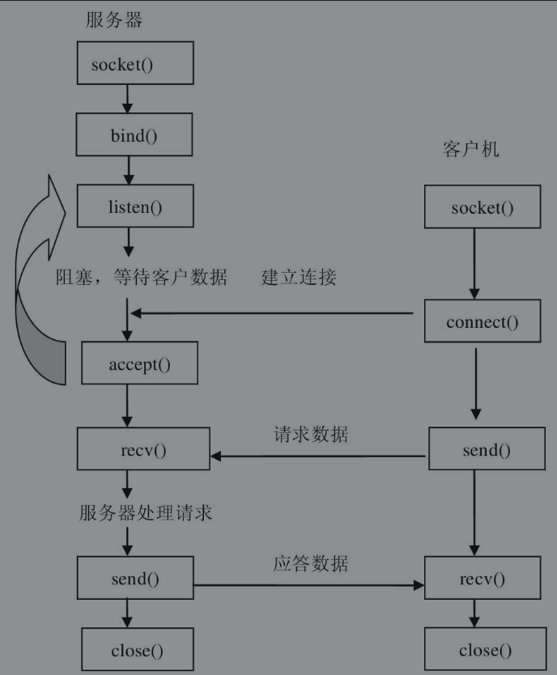
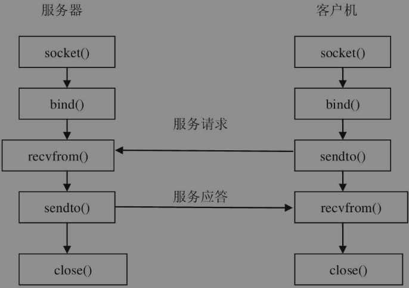

# 网络编程基础

## 互联网 TCP / IP

为了使计算机联网，就必须规定通信协议。早期的计算机网络，都由各厂商自己规定一套协议，如IBM、Apple和Microsoft都有各自的网络协议，互不兼容。这就好比一群人，有的说英语，有的说法语，有的说德语，说同一种语言的人可以交流，说不同语言的人相互之间就无法交流。

为了把全世界的所有不同类型的计算机都连接起来，就必须规定一套全球通用的协议，因此，国际标准化组织制定了OSI七层模型互联网协议标准，如图所示。虽然互联网协议包含了上百种协议标准，但是其中最重要的两个协议是TCP和IP，因此，人们把互联网的协议简称为TCP/IP。


## IP

在通信时，通信双方必须知道对方的标识，如同用户发邮件时必须知道对方的邮件地址一样。**互联网上每台计算机的唯一标识就是IP地址**，如202.196.32.7。如果一台计算机同时接入两个或更多的网络，如路由器，那么它就会有两个或多个IP地址。因此，**IP地址对应的实际上是计算机的网络接口，通常是网卡。**

IP负责把数据从一台计算机通过网络发送到另一台计算机。数据被分割成一小块一小块，然后通过IP包发送出去。由于互联网链路复杂，两台计算机之间经常有多条线路，因此，**路由器就负责决定如何把一个IP包转发出去。**

**IP包的特点是按块发送，途径多个路由，但不保证能到达，也不保证顺序到达。**

IPv4版的IP地址实际上是一个32位整数，以字符串表示的IP地址如192.168.0.1实际上是把32位整数按8位分组后的数字表示，目的是便于阅读。

IPv6版的IP地址实际上是一个128位整数，它是目前使用的IPv4的升级版，以字符串表示类似于2001:0db8:85a3:0042:1000:8a2e:0370:7334。

## TCP 和 UDP

### TCP

> TCP是建立在IP之上，是面向 **<font color="orange">有连接</font>** 的通信协议。
>
> TCP负责在两台计算机之间建立 **<font color="orange">可靠连接</font>**，保证数据包按**<font color="orange">顺序到达</font>**。
>
> TCP通过握手建立连接，然后，对每个IP包编号，确保对方按顺序收到，如果包丢失，就自动重发。

许多常用的更高级的协议都是建立在TCP基础上的，如用于浏览器的HTTP、发送邮件的SMTP等。

### UDP

> UDP，同样是建立在IP之上，但它是面向 **<font color="orange">无连接的通信协议</font>**。
>
> UDP **<font color="orange">不能保证数据包的顺利到达</font>**，是 **<font color="orange">不可靠传输</font>**，但 **<font color="orange">传输效率比TCP高</font>**。

## 端口

一个IP包除了包含要传输的数据外，还包含源IP地址和目标IP地址、源端口和目标端口。

### 端口的作用

在两台计算机进行通信时，只发IP地址是不够的，因为同一台计算机上还运行着多个网络程序（如浏览器、QQ等网络程序）。一个IP包到来之后，到底是交给浏览器还是QQ，就需要通过端口号来进行区分。

每个网络程序都向操作系统申请唯一的端口号，这样，两个进程在两台计算机之间建立网络连接就需要各自的IP地址和各自的端口号。例如，浏览器常常使用80端口，FTP程序使用21端口，邮件收发使用25端口。

网络上两个计算机之间的数据通信，归根结底就是不同主机的进程交互，而每个主机的进程都对应着某个端口。也就是说，单独靠IP地址是无法完成通信的，必须要有IP和端口

## Socket 套接字

Socket（套接字）是网络编程的一个抽象概念，主要用于网络通信编程。

20世纪80年代初，美国政府的高级研究工程机构（ARPA）给加利福尼亚大学Berkeley分校提供了资金，让他们在UNIX操作系统下实现TCP/IP。在这个项目中，研究人员为TCP/IP网络通信开发了一个API（应用程序接口），这个API称为socket（套接字）。

socket是TCP/IP网络最为通用的API。任何网络通信都是通过socket来完成的。

通常用一个socket表示“打开了一个网络链接”，而打开一个网络链接只需知道目标计算机的IP地址和端口号，再指定协议类型即可。

### 套接字构造函数 **<font color="orange"> socket（family,type[,protocal]） </font>**

它使用给定的套接字家族、套接字类型、协议编号来创建套接字。

- 参数说明：
  - **<font color="orange">family </font>: 套接字家族，可以是 AF_UNIX 或者 AF_INET、AF_INET6.**
  - **<font color="orange">type</font>：套接字类型，可以根据是面向连接的还是非连接分为 SOCK_STREAM 或 SOCK_DGRAM.**
  - **<font color="orange">protocol</font> : 协议，一般不填，默认为 0.**

- 参数取值含义如下表：


|                         参数                          | 描述                                                         |
| :---------------------------------------------------: | :----------------------------------------------------------- |
|    **<font color="orange">socket.AF_UNIX</font>**     | **只能够用于单一的 UNIX 系统进程间的通信**                   |
|    **<font color="orange">socket.AF_INET</font>**     | **用于服务器之间的网络通信**                                 |
|    **<font color="orange">socket.AF_INET6</font>**    | **IPv6**                                                     |
|  **<font color="orange">socket.SOCK_STREAM</font>**   | **流式 socket，可以用于 TCP**                                |
|   **<font color="orange">socket.SOCK_DGRAM</font>**   | **数据报式 socket，可以用于 UDP**                            |
|    **<font color="orange">socket.SOCK_RAW</font>**    | **1. 原始套接字，普通套接字无法处理 ICMP、IGMP 等网络报文，而 SOCK_RAW 可以**；<br>**2. SOCK_RAW 也可处理特殊的 IPv4 报文；** <br>**3. 利用原始套接字，可以通过 IP_HDRINCL 套接字选项由用户构造 IP 头.** |
| **<font color="orange">socket.SOCK_SEQPACKET</font>** | **可靠的连续数据包服务**                                     |
|                                                       |                                                              |

- 例子：

  ```python
  # 创建 TCP socket 语句
  s = socket.socket(socket.AF_INET, socket.SOCK_STREAM)
  ```

  ```python
  # 创建 UDP socket 语句
  s = socket.socket(socket.AF_INET, socket.SOCK_DGRAM)
  ```


### socket 同时支持 **数据流 socket** 和 **数据报 socket**

下面是利用 socket 进行通信连接的过程框图。

其中，第一幅图是 **面向连接支持数据流 TCP 的时序图**；第二幅图，是 **无连接数据报 UDP 的时序图**。




​														**面向连接支持数据流 TCP 的时序图**




​															**连接数据报 UDP 的时序图**

从 **面向连接支持数据流 TCP 的时序图** 可以看出，客户机（Client） 与 服务器 （Server）的关系是不对称的。

对于 **TCP C/S**，首先，服务器启动，在某一时刻启动客户机与服务器建立连接。然后，服务器与客户机都必须调用socket()建立一个套接字socket，服务器调用bind()将套接字与一个本机指定端口绑定在一起，再调用listen()使套接字处于一种被动的准备接收的状态。接着，客户机建立套接字便可通过调用connect()与服务器建立连接，服务器就可以调用accept()来接收客户机连接，然后继续侦听指定端口，并发出阻塞，直到下一个请求出现，从而实现连接多个客户机。最后，连接建立之后，客户机和服务器之间就可以通过连接发送和接收数据。待数据传送结束，双方调用close()关闭套接字。

对于UDP C/S，客户机并不与服务器建立一个连接，而仅仅调用函数sendto()给服务器发送数据报。类似地，服务器端也不从客户端接收连接，只是调用函数recvfrom()，等待从客户端传来的数据。依照recvfrom()得到的协议地址以及数据报，服务器就可以给客户机回复应答。

- **socket对象提供的函数方法**

| 函数                                                         | 描述                                                         |
| :----------------------------------------------------------- | :----------------------------------------------------------- |
| **服务器端套接字**                                           |                                                              |
| **<font color="orange">s.bind(host, port)</font>**           | **绑定地址（host, port）到套接字，在 AF_INET 下以元组 （host, port) 的形式表示地址.** |
| **<font color="orange">s.listen(backlog)</font>**            | **开始 TCP 监听。 backlog 指定在拒绝连接之前，可以设置最大连接数量. 该值至少为 1，大部分应用程序设为 5 即可.** |
| **<font color="orange">s.accept()</font>**                   | **被动接受 TCP 客户端连接（阻塞式），等待连接的导论.**       |
| **客户端套接字**                                             |                                                              |
| **<font color="orange">s.connect(address)</font>**           | **主动与 TCP 服务器连接. address 的一般格式为 元组 (hostname, port), 如果连接出错，则返回 socket.error 错误。** |
| **<font color="orange">s.connect_ex()</font>**               | **connect() 函数的扩展版本，出错时返回出错码，而不是抛出异常。** |
| **公共用途的套接字函数**                                     |                                                              |
| **<font color="orange">s.recv(bufsize, [, flag])</font>**    | **接收 TCP 数据，数据以字节串形式返回，bufsize 指定要接收的最大数据量. flag 提供有关消息的其他信息，通常可以忽略.** |
| **<font color="orange">s.send(data)</font>**                 | **发送 TCP 数据，将 data 中的数据发送到连接的套接字。返回值是要发送的字节数量，该数量可能小于 data 的字节大小.** |
| **<font color="orange">s.sendall(data)</font>**              | **完整发送 UDP 数据，将 data 中的数据发送到连接的套接字，但在返回之前会尝试发送所有数据. 成功返回 None，失败抛出异常.** |
| **<font color="orange">s.recvform(bufsize, [, flag])</font>** | **接收 UDP 数据，与 recv() 类似，但返回值是 (data, address). 其中，data 是包含接收数据的字节串，address 是发送数据的套接字地址.** |
| **<font color="orange">s.sendto(data, address)</font>**      | **发送 UDP 数据，将数据发送到套接字，address 是形式为 (ip, port) 的元组，指定远程地址. 返回值是发送的字节数.** |
| **<font color="orange">s.close()</font>**                    | **关闭套接字.**                                              |
| **<font color="orange">s.getpeername()</font>**              | **返回连接套接字的原创地址，返回值通常是 元组 (ipaddr, port).** |
| **<font color="orange">s.getsockname()</font>**              | **返回套接字自己的地址，通常是一个 元组(ipaddr, port).**     |
| **<font color="orange">s.getsockopt(level, optname, value)</font>** | **设置给定套接字选项的值.**                                  |
| **<font color="orange">s.getsockopt(level, optname)</font>** | **返回套接字选项的值.**                                      |
| **<font color="orange">s.settimeout(timeout)</font>**        | **设置套接字操作的超时时间，timeout 是一个浮点数，单位是秒. 值为 None 表示没有超时时间. 一般地，超时时间应该在刚创建套接字时设置，因为它们可能用于连接的操作（如 connect()).** |
| **<font color="orange">s.gettimeout()</font>**               | **返回当前超时时间的值，单位是秒，如果没有设置超时时间，则返回 None.** |
| **<font color="orange">s.fileno()</font>**                   | **返回套接字的文件描述符.**                                  |
| **<font color="orange">s.setblocking(flag)</font>**          | **如果 flag 为 0，则将套接字设为 非阻塞模式；否则，将套接字设为阻塞模式（默认值）.     非阻塞模式下，如果调用 recv() 没有发现任何数据，或  send() 调用无法立即发送数据，将引起 socket.error 异常.** |
| **<font color="orange">s.makefile()</font>**                 | **创建一个与该套接字相关连的文件.**                          |
|                                                              |                                                              |

了解了 TCP/IP 基本概念、IP地址、端口的概念 和 socket 后，就可以开始进行网络编程了.