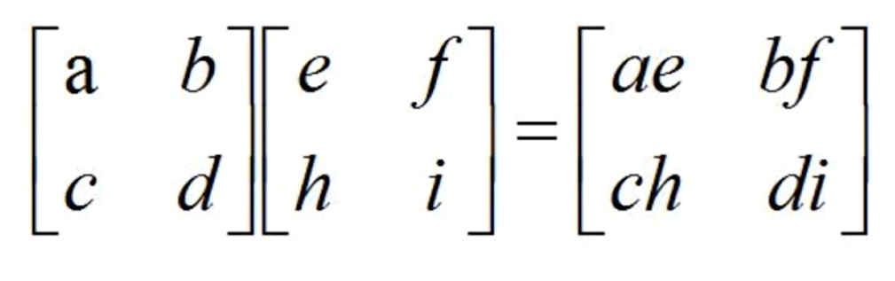
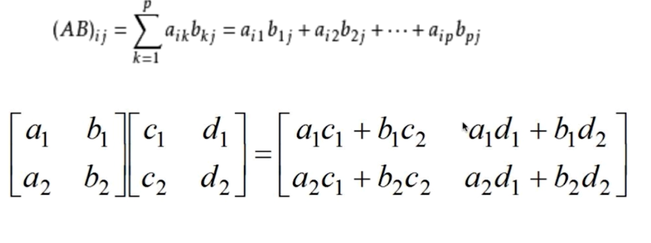

# 数学基础回顾之矩阵运算

### 矩阵

- 矩阵 ： 矩形的数组，即二维数组。其中向量和标量都是矩阵
的特列.

- 向量 ：是指 1 x n 或者 n x 1 的矩阵.

- 标量 ：1 x 1 的矩阵.

- 数组 ：N 维的数组，是矩阵的延伸.

### 特殊矩阵

- 全0 全1 矩阵

- 单位矩阵

### 矩阵加减运算

- 相加、减的两个矩阵必须要有相同的行和列

- 行和列对应元素相加减

### 数组乘法（点乘）

- 数组乘法（点乘）是对应元素之间的乘法

### 矩阵乘法

- 设 A 为 m x p 的矩阵， B 为 p x n 的矩阵，m x n 的矩阵 C 为 A 与 B 的乘积，记为 C = AB， 其中矩阵 C 中的第 i 行 第 j 列元素可以表示为：

