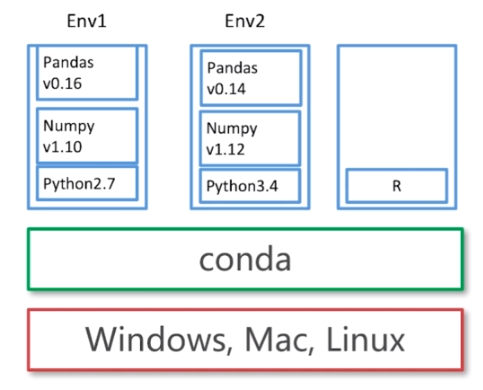
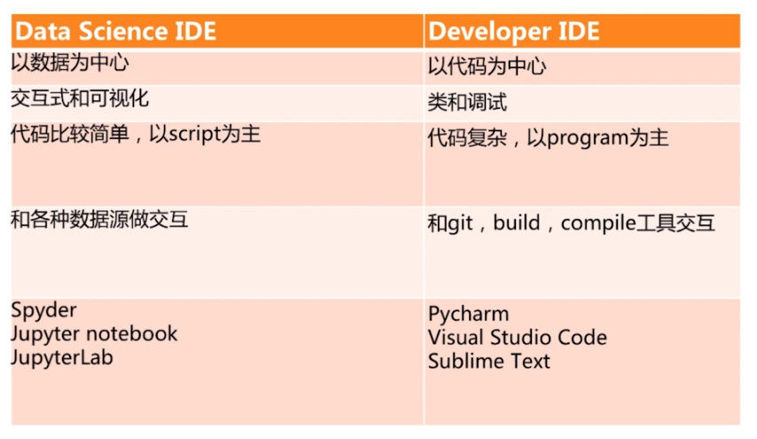
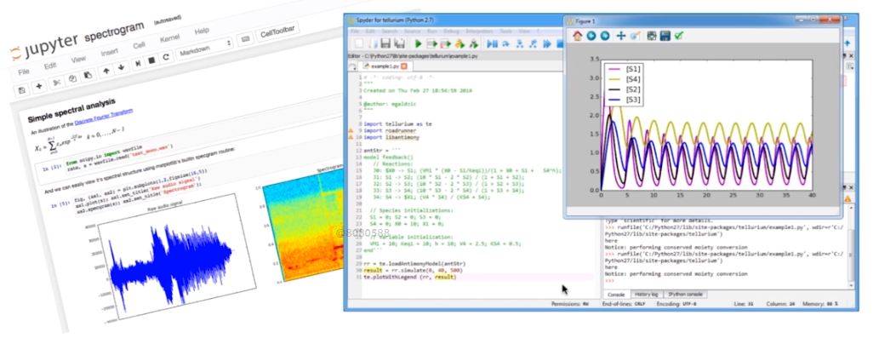
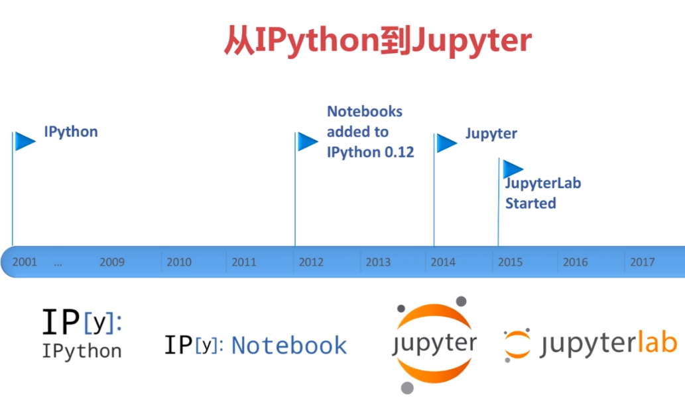
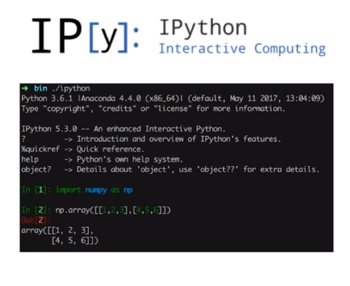
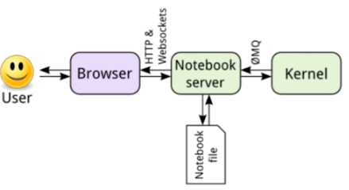
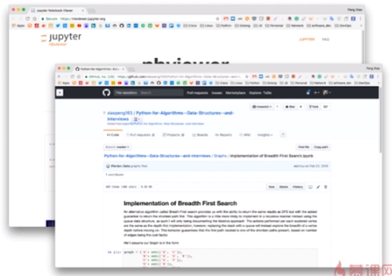

# Anaconda 和 Jupyter Notebook 介绍

## Anaconda 是什么？

- 最著名的Python数据科学平台
  
- 750+ 流行的 Python & R 包
  
- 跨平台 ： Windows, Mac, Linux
  
- conda : 可扩展的包管理工具
  
- 免费分发
  
- 非常活跃的社区
  
- [Download](https://www.anaconda.com/download/)
  

### Package 和 Environment 管理

- 安装 Packages
  
- 更新 Packages

- 创建沙盒 ： Conda Environment (其中 environment 为 虚拟环境)
  

### 语句

- 创建一个新的 environment

  - ** conda create -- name python34 python = 3.4**

- 激活一个 environment

   - ** activate python34 ** # for Windows
  
   - ** source activate python34 ** # for Linux & Mac

- 退出一个 environment

    - ** deactivate python34 ** # for Windows

    - ** source deactivate python 34 ** # for Linux & Mac

- 删除一个 environment

    - ** conda remove --name python34 --all **

- Conda 的包管理有点类似 pip
  
- 安装一个 Python 包
  
  - ** conda install numpy **

- 查看已安装的 Python 包

    - ** conda list   conda list -n python34 ** # 查看指定环境安装的 Python 包
  
- 删除一个 Python 包

    - ** conda remove -n python34 numpy **

### Data Science IDE VS Developer IDE

### 从 IPython 到 Jupyter

#### 什么是 Ipython？

- 一个强大的交互式 **shell**
  
- 是 **Jupyter** 的 **Kernel**
  
- 支持交互式数据分析和可视化

#### Ipython Kernel

- 主要负责运行用户代码
  
- 通过 stdin/stdout 和 Ipython shell 交互

- 用 json message 通过 ZeroMQ 和 notebook 交互
  

### 什么事 Jupyter Notebook？

- 前身是 Ipython notebook

- 一个开源的 Web application

- 可以创建和分享包含代码，视图，注释的文档 

- 可以用于数据统计，分析，建模，机器学习等领域

### Notebook 和 Kernel 之间的交互

- 核心是 Notebook server

- Notebook server 加载和保存 notebook

### Notebook 的文件格式 (.ipynb)

- 由 Ipython Notebook 定义的一种格式 (json)

- 可以读取在线数据, CSV/XLS 文件

- 可以转换成其他格式 (py, html, pdf, md 等)

### NBViewer

- 一个 online 的 ipynb 格式 notebook 展示工具

- 可以通过 URL 分享

- GitHub 集成了 NB Viewer

- 通过转换器轻松集成到 Blogs, Emails, Wikis, Books
  
