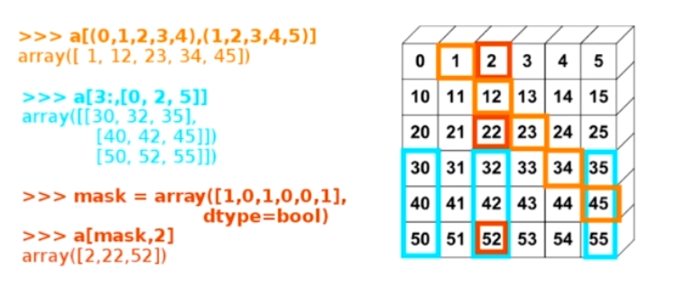
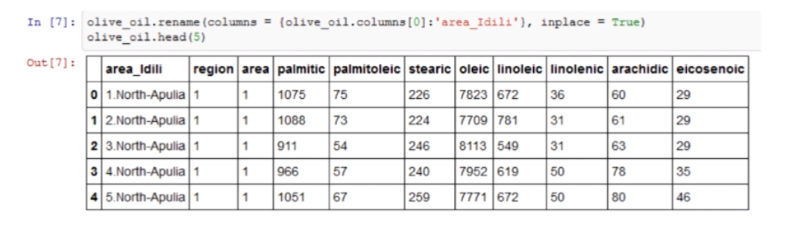
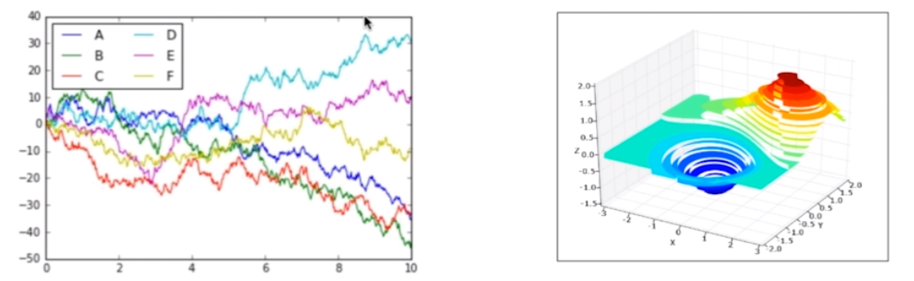
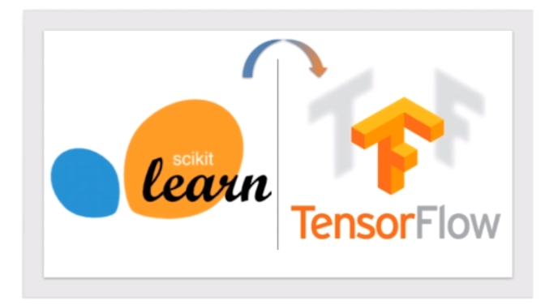

# 数据科学领域5个最佳 Python 库

Numpy / Scipy / Pandas / Matplotlib / Scikit-learn

### **Numpy**

- N 维数组（矩阵），快速高效，矢量数学运算
  
- 高效的 Index，不需要循环

- 开源免费跨平台，运行效率足以和 C/Matlab 媲美

### **Scipy**

- 依赖于 Numpy

- 专为科学和工程设计

- 实现了多种常用科学计算 ： 线性代数、傅里叶变换、信号和图像处理
  
### **Pandas**

- 结构化数据分析利器 （依赖 Numpy）

- 提供了多种高级数据结构 ： Time-Series， DataFrame， Panel

- 强大的数据索引和处理能力

### **Matplotlib**

- Python 2D 绘图领域使用最广泛的套件

- 基本能取代 Matlab 的绘图功能 （散点、曲线、柱形等）
  
- 通过 mplot3d 可以绘制精美的 3D 图

### **Scikit-learn**

- 机器学习的 Python 模块

- 建立在　Scipy 之上，提供了常用的机器学习算法 ： 聚类、回归

- 简单易学的 API 接口

