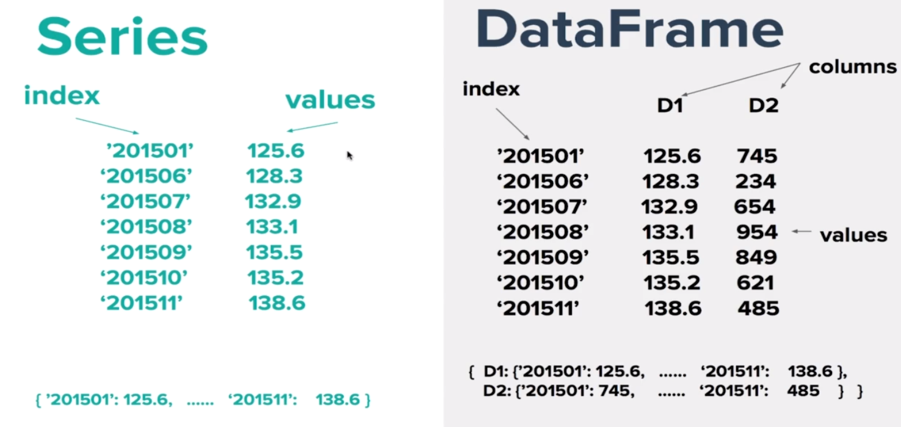

# Summary for Series and Dataframe

Series 是一维的数据结构，具有 index 和 values 属性.

Data Frame 是二维的数据结构，由多个 Series 组成，具有 index 、values 和 columns 属性.




## 例子


```python
import numpy as np
import pandas as pd
from pandas import Series,DataFrame
```


```python
data = {'Country':['Belgium', 'India', 'Brazil'],
       'Capital':['Brussels','New Delhi','Brasilia'],
       'Population':[11190846,1303171035,207847524]}
```

# Series


```python
s1 = pd.Series(data['Country'], index=['A','B','C'])
```


```python
s1
```


    A    Belgium
    B      India
    C     Brazil
    dtype: object


```python
s1.values
```


    array(['Belgium', 'India', 'Brazil'], dtype=object)


```python
s1.index
```


    RangeIndex(start=0, stop=3, step=1)


# Dataframe


```python
df1 = pd.DataFrame(data)
```


```python
df1
```


<div>
<style scoped>
    .dataframe tbody tr th:only-of-type {
        vertical-align: middle;
    }

    .dataframe tbody tr th {
        vertical-align: top;
    }
    
    .dataframe thead th {
        text-align: right;
    }
</style>
<table border="1" class="dataframe">
  <thead>
    <tr style="text-align: right;">
      <th></th>
      <th>Country</th>
      <th>Capital</th>
      <th>Population</th>
    </tr>
  </thead>
  <tbody>
    <tr>
      <th>0</th>
      <td>Belgium</td>
      <td>Brussels</td>
      <td>11190846</td>
    </tr>
    <tr>
      <th>1</th>
      <td>India</td>
      <td>New Delhi</td>
      <td>1303171035</td>
    </tr>
    <tr>
      <th>2</th>
      <td>Brazil</td>
      <td>Brasilia</td>
      <td>207847524</td>
    </tr>
  </tbody>
</table>
</div>


## Access dataframe column


```python
# access dataframe 1st. column
column1 = df1['Country']
```


```python
column1
```


    0     Brussels
    1    New Delhi
    2     Brasilia
    Name: Capital, dtype: object


```python
type(column1) 
```


    pandas.core.series.Series


```python
# access dataframe 2nd. column
column2 = df1['Capital']
```


```python
column2
```


    0     Brussels
    1    New Delhi
    2     Brasilia
    Name: Capital, dtype: object


```python
# access dataframe 3rd. column
```


```python
column3 = df1['Population']
```


```python
column3
```


    0      11190846
    1    1303171035
    2     207847524
    Name: Population, dtype: int64


## Access dataframe row


```python
# create a generaotr object
df1.iterrows()
```


    <generator object DataFrame.iterrows at 0x000001ADA38331C8>


### generator object can be traversal by for loop


```python
# way1
for row in df1.iterrows():
    print(row), print(type(row)), print(len(row))
```

    (0, Country        Belgium
    Capital       Brussels
    Population    11190846
    Name: 0, dtype: object)
    <class 'tuple'>
    2
    (1, Country            India
    Capital        New Delhi
    Population    1303171035
    Name: 1, dtype: object)
    <class 'tuple'>
    2
    (2, Country          Brazil
    Capital        Brasilia
    Population    207847524
    Name: 2, dtype: object)
    <class 'tuple'>
    2


```python
# way2
for row in df1.iterrows():
    print(row[0],row[1])  # row[0] - index for every row, row[1] - information for every row
```

    0 Country        Belgium
    Capital       Brussels
    Population    11190846
    Name: 0, dtype: object
    1 Country            India
    Capital        New Delhi
    Population    1303171035
    Name: 1, dtype: object
    2 Country          Brazil
    Capital        Brasilia
    Population    207847524
    Name: 2, dtype: object


## Dataframe is made up of many Serieses.


```python
for row in df1.iterrows():
    print(type(row[0]), type(row[1]))
    break
```

    <class 'int'> <class 'pandas.core.series.Series'>


## Use several Serieses to create a dataframe.


```python
df1
```


<div>
<style scoped>
    .dataframe tbody tr th:only-of-type {
        vertical-align: middle;
    }

    .dataframe tbody tr th {
        vertical-align: top;
    }
    
    .dataframe thead th {
        text-align: right;
    }
</style>
<table border="1" class="dataframe">
  <thead>
    <tr style="text-align: right;">
      <th></th>
      <th>Country</th>
      <th>Capital</th>
      <th>Population</th>
    </tr>
  </thead>
  <tbody>
    <tr>
      <th>0</th>
      <td>Belgium</td>
      <td>Brussels</td>
      <td>11190846</td>
    </tr>
    <tr>
      <th>1</th>
      <td>India</td>
      <td>New Delhi</td>
      <td>1303171035</td>
    </tr>
    <tr>
      <th>2</th>
      <td>Brazil</td>
      <td>Brasilia</td>
      <td>207847524</td>
    </tr>
  </tbody>
</table>
</div>


```python
data
```


    {'Country': ['Belgium', 'India', 'Brazil'],
     'Capital': ['Brussels', 'New Delhi', 'Brasilia'],
     'Population': [11190846, 1303171035, 207847524]}


```python
s1 = pd.Series(data['Country'])
s1
```


    0    Belgium
    1      India
    2     Brazil
    dtype: object


```python
s2 = pd.Series(data['Capital'])
s2
```


    0     Brussels
    1    New Delhi
    2     Brasilia
    dtype: object


```python
s3 = pd.Series(data['Population'])
s3
```


    0      11190846
    1    1303171035
    2     207847524
    dtype: int64


# <font color="orange"> Example </font>


```python
df_new = pd.DataFrame([s1,s2,s3], index = ['Country','Capital','Population'])
df_new # row is perversion to column
```


<div>
<style scoped>
    .dataframe tbody tr th:only-of-type {
        vertical-align: middle;
    }

    .dataframe tbody tr th {
        vertical-align: top;
    }
    
    .dataframe thead th {
        text-align: right;
    }
</style>
<table border="1" class="dataframe">
  <thead>
    <tr style="text-align: right;">
      <th></th>
      <th>0</th>
      <th>1</th>
      <th>2</th>
    </tr>
  </thead>
  <tbody>
    <tr>
      <th>Country</th>
      <td>Belgium</td>
      <td>India</td>
      <td>Brazil</td>
    </tr>
    <tr>
      <th>Capital</th>
      <td>Brussels</td>
      <td>New Delhi</td>
      <td>Brasilia</td>
    </tr>
    <tr>
      <th>Population</th>
      <td>11190846</td>
      <td>1303171035</td>
      <td>207847524</td>
    </tr>
  </tbody>
</table>
</div>


```python
df_new = df_new.T
df_new  # exchange row with column
```


<div>
<style scoped>
    .dataframe tbody tr th:only-of-type {
        vertical-align: middle;
    }

    .dataframe tbody tr th {
        vertical-align: top;
    }
    
    .dataframe thead th {
        text-align: right;
    }
</style>
<table border="1" class="dataframe">
  <thead>
    <tr style="text-align: right;">
      <th></th>
      <th>Country</th>
      <th>Capital</th>
      <th>Population</th>
    </tr>
  </thead>
  <tbody>
    <tr>
      <th>0</th>
      <td>Belgium</td>
      <td>Brussels</td>
      <td>11190846</td>
    </tr>
    <tr>
      <th>1</th>
      <td>India</td>
      <td>New Delhi</td>
      <td>1303171035</td>
    </tr>
    <tr>
      <th>2</th>
      <td>Brazil</td>
      <td>Brasilia</td>
      <td>207847524</td>
    </tr>
  </tbody>
</table>
</div>


```python
df1
```


<div>
<style scoped>
    .dataframe tbody tr th:only-of-type {
        vertical-align: middle;
    }

    .dataframe tbody tr th {
        vertical-align: top;
    }
    
    .dataframe thead th {
        text-align: right;
    }
</style>
<table border="1" class="dataframe">
  <thead>
    <tr style="text-align: right;">
      <th></th>
      <th>Country</th>
      <th>Capital</th>
      <th>Population</th>
    </tr>
  </thead>
  <tbody>
    <tr>
      <th>0</th>
      <td>Belgium</td>
      <td>Brussels</td>
      <td>11190846</td>
    </tr>
    <tr>
      <th>1</th>
      <td>India</td>
      <td>New Delhi</td>
      <td>1303171035</td>
    </tr>
    <tr>
      <th>2</th>
      <td>Brazil</td>
      <td>Brasilia</td>
      <td>207847524</td>
    </tr>
  </tbody>
</table>
</div>


