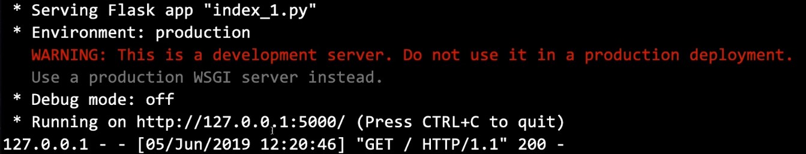

# Flask 框架

## 说明

### FLASK 基础框架说明

file name : index_1.py

```python
# index_1.py
from flask import Flask     # 导入 flask 扩展中的 Flask 类
app = Flask(__name__)       # 实例化：定一个变量 app，并传递参数 __name__ 

@app.route("/")             # 装饰器，传入路由变量 / pass
def hello():                # 定义一个名为 hello 的函数
    return "Hello World!"   # 返回字符串 Hello World!
```

说明：

- **Line 3 : Flask初始化参数尽量使用你的包名，这个初始化方式是官方推荐的**，[官方解释](http://flask.pocoo.org/docs/0.12/api/#flask.Flask)
- 以上基本框架是为 **本机访问**

### 运行指令

```shell
$ export FLASK_APP = index_1.py
$ flask run
$ flask run --host 0.0.0.0
$ flask run --help
```


## 运行

### Windows 平台

- 在此文件的当前路径，执行一下两行命令行：

  ```shell
  set FLASK_APP=index_1.py
  flask run
  ```

- 输出结果：



- 打开输出结果中的网址：

  
  
  ## 运行结果说明
  
  ```shell
  Running on http://127.0.0.1:500/
  ```
  
  说明：
  
  - 127.0.0.1 : 特指本地主机才能访问
  
  如果想让别人访问，则需要执行一下命令：
  
  ```shell
  flask run --host 0.0.0.0
  ```
  
  结果：
  
  ```shell
  Runing on http://0.0.0.0:500/
  ```
  
  说明：
  
  - 0.0.0.0 ：说明的是监听整块网卡，整块网卡都是对外开放的
