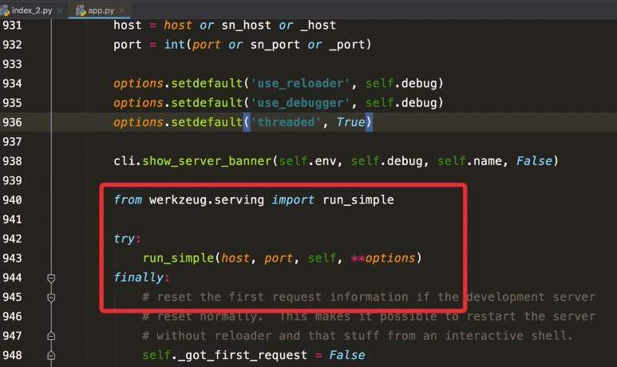
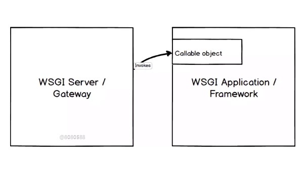
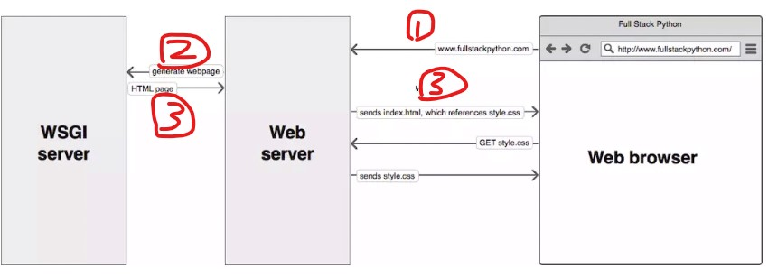

# Flask 为什么可以独立运行


- 源码截图：

  红色圈起来的部分为核心部分，在加载后，会运行一个来自 werkzeug.serving 包中的 run_simple 模块




### Werkzeug

- Werkzeug 是一个 WSGI（Web 服务网关接口） 工具包，也可以作为一个 Web 框架的底层库；

- WSGI(Web Serve Gateway Interface) 
  - 定义了 Web 应用程序之间通讯接口的工具；
  - 是一种规范，具体看每一部分如何实现；
  - 分为两部分 ：WSGI Serve  / Gateway + WSGI Application / Framework
    - WSGI Serve / Gate Way 请求完成后，触发 WSGI Application / Framework
    
      
    
    - 步骤举例：
      - Step 1 ： 浏览器打开网址，发出请求到 Web Server；
      
      - Step 2 ：Web Server 实现 WSGI 协议 ，然后再发送到  WSGI Server;
      
      - Step 3 ：在 WSIG Server 层开始监听通讯，结束后将请求返回给客户端，即浏览器。
      
        


### 例子：返回 Hello World ~~


```python
from Tools.scripts.serve import app

class Shortly(object):
    def __call__(self,environ,start_response):
        # 设置响应（格式暂时固定）
        start_response('200 OK',[('Content-Type','text/plain')])
        # 设置返回内容
        return [b'Hello World ~~']

if __name__=="__main__":
    from werkzeug.serving import run_simple
    app = Shortly()
    run_simple('0.0.0.0',5000,app)
```

说明：

- Ctrl 后用鼠标点击，run_simple 函数名字，可以查看 源码 所需要的参数；
- application 对象 用一个 类承接，将要响应的内容 Hello World ~~ 写在 Shortly Class 中；

- 200 OK : 状态码 **`200 OK`** 表明请求已经成功. 默认情况下状态码为200的响应可以被缓存;
- return 中的 b 将 返回值设置为 byte 类型.