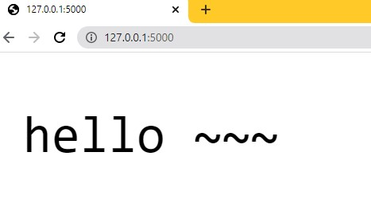
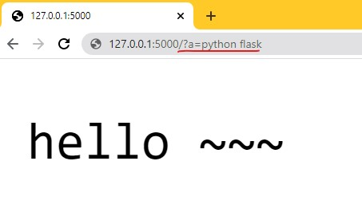
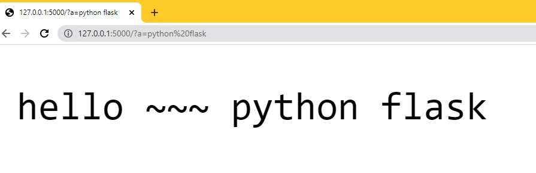
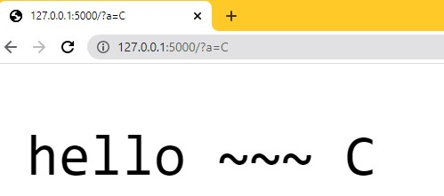

# Flask 为什么可以独立运行

### 源码截图

红色圈起来的部分为核心部分，在加载后，会运行一个来自 werkzeug.serving 包中的 run_simple 模块


### Werkzeug 

- [中文官网](https://werkzeug-docs-cn.readthedocs.io/zh_CN/latest/index.html)

- Werkzeug 是一个 WSGI（Web 服务网关接口） 工具包，也可以作为一个 Web 框架的底层库。

- WSGI(Web Serve Gateway Interface) 
  - 定义了 Web 应用程序之间通讯接口的工具；
  - 是一种规范，具体看每一部分如何实现；
  - 分为两部分 ：WSGI Serve  / Gateway + WSGI Application / Framework
    - WSGI Serve / Gate Way 请求完成后，触发 WSGI Application / Framework
    
      
    
    - 步骤举例：
      - Step 1 ： 浏览器打开网址，发出请求到 Web Server；
      
      - Step 2 ：Web Server 实现 WSGI 协议 ，然后再发送到  WSGI Server;
      
      - Step 3 ：在 WSIG Server 层开始监听通讯，结束后将请求返回给客户端，即浏览器。
      
        


### 例子：返回 Hello World ~~


```python
from Tools.scripts.serve import app

class Shortly(object):
    def __call__(self,environ,start_response):
        # 设置响应（格式暂时固定）
        start_response('200 OK',[('Content-Type','text/plain')])
        # 设置返回内容
        return [b'Hello World ~~']

if __name__=="__main__":
    from werkzeug.serving import run_simple
    app = Shortly()
    run_simple('0.0.0.0',5000,app)
```

说明：

- Ctrl 后用鼠标点击，run_simple 函数名字，可以查看 源码 所需要的参数；
- application 对象 用一个 类承接，将要响应的内容 Hello World ~~ 写在 Shortly Class 中；

- 200 OK : 状态码 **`200 OK`** 表明请求已经成功. 默认情况下状态码为200的响应可以被缓存;
- return 中的 b 将 返回值设置为 byte 类型.


### 使用Werkzeug优化


```python
from werkzeug.wrappers import Request, Response

class Shortly(object):
    def __call__(self,environ,start_response):
        # start_response('200 OK',[('Content-Type','text/plain')])
        # return [b'hello world~~']
        text = "hello ~~~"
        request = Request(environ) 							# 请求
        response = Response(text, mimetype = "text/plain")	  # 响应
        return response( environ, start_response)

if __name__=="__main__":
    from werkzeug.serving import run_simple
    app = Shortly()
    run_simple('0.0.0.0',5000,app)
    
```


`注意：此时，在本机上访问需要使用默认的127.0.0.1（也就是不设置ip时默认的ip）,在外网上访问则需要使用本机的ip，不要使用0.0.0.0。`

- 结果

  

### 在网页上输入一个参数并赋值，并把在网页上打印出来

- a = ,python flask

  `注意：在地址后写入 /?需要输入的变量名字=变量值`



- 代码 ：`注释部分非常重要`

  

  ```python
  from werkzeug.wrappers import Request, Response
  
  class Shortly(object):
      def __call__(self,environ,start_response):
          # start_response('200 OK',[('Content-Type','text/plain')])
          # return [b'hello world~~']
          request = Request(environ)
          text = "hello ~~~ %s"%(request.args.get('a',''))
          # %s 字符串格式化
          # request.args.get - 接收从网页输入的参数参数
          # 第一个参数为请求参数
          # 第二参数为默认参数，即当没有第一个参数时，打印第二个默认参数，一般为空
          # 即，a - 网页输入的第一个请求参数； ‘’ - 默认参数
          response = Response(text, mimetype = "text/plain")
          return response( environ, start_response)
  
  if __name__=="__main__":
      from werkzeug.serving import run_simple
      app = Shortly()
      run_simple('0.0.0.0',5000,app)
  
  ```

  

- 重新运行代码

  

- 改变输入 a 参数的值，并确认地址

  

  


## 网关接口分类

- **CGI（Common Gateway Interface) 通用网关接口** : 一种重要的互联网技术，可以让一个客户端，从网页浏览器向执行在网络服务器上的程序请求数据。CGI描述了服务器和请求处理程序之间传输数据的一种标准。定义了客户端服务器之间如何传数据。

- **FastCGI(Fast Common GateWay Interface) 快速通用网关接口** : 一种让交互程序与Web服务器通信的协议。FastCGI是早期通用网关接口（CGI）的增强版。FastCGI致力于减少网页服务器与CGI程序之间互动的开销，从而使服务器可以同时处理更多的网页请求，常见的Nginx、Apache都有实现该协议。

- **WSGI（Python Web Server Gateway Interfacce) Web 服务器网关接口** : 为 Python 语言定义的 Web 服务器和Web应用程序或框架之间的一种简单而通用的接口。自从 WSGI 被开发出来以后，许多其语言中除了类似接口。为 Python 定义的 Web 服务器 和 Web 框架之间的接口标准。
- **uWSGI** : 一个 Web Server, 即一个实现了 WSG 的服务器。
- **uwsgi** ：uWSGI 服务器实现的独有的协议。

