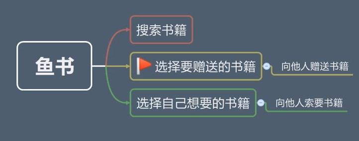

[toc]


# 项目介绍

### 鱼书

将自己不要的书，免费赠送给他人.

### 介绍



# 准备工作


### 安装 python 环境

### 检验 python 和 pip 是否安装好

### 新建项目文件夹

```shell
- cd directory_name ： 进入 当前目录下的 directory 文件夹

- mkdir directory_name ： 创建 directory_name 文件夹

```

### 使用 pipenv 创建虚拟环境和项目绑定


```shell
- pip install pipenv : 安装 pipenv 虚拟环境包

- pip list : 打印已经安装的包

- pipenv install : 创建 pipenv 虚拟环境

- pipenv shell ： 进入 pipenv 虚拟环境

- pipenv exit : 退出 pipenv 虚拟环境

- pipenv install flask : 在虚拟环境 pipenv 中 安装 flask 包

- pipenv uninstall flask ：在虚拟环境 pipenv 中 卸载 flask 包

- pipenv graph : 在虚拟环境 pipenv 中 检查 flask 版本
```

### 开发工具

1. Pycharm ( or VS Code) : IDE 编辑器
2. Xampp (MySQL) : 安装 MySQL
3. Navicat (数据可视化管理工具)

### 设置开发工具的默认解释器

1. 打开 项目 文件夹
2. File -> Settings -> Project : 项目名 -> Project : Interpreter 选择需要的虚拟环境

```shell
- pipenv --venv : 查看 pipenv 虚拟环境安装目录
```

